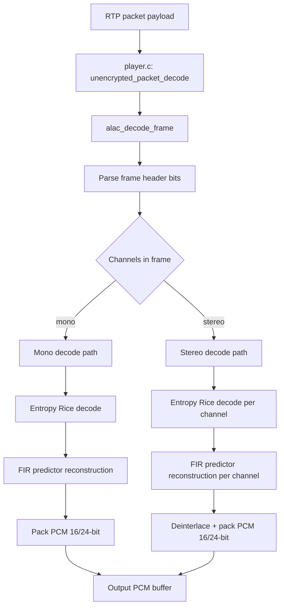

# ALAC Hammerton Decoder: Purpose and Flow

## Purpose

The Hammerton ALAC decoder in this repository provides software decoding of Apple Lossless (ALAC) RTP payloads into PCM samples for playback. It is used when:

- Stream type is Apple Lossless.
- Build includes `CONFIG_HAMMERTON`.
- Runtime selects the Hammerton decoder path.

Main implementation files:

- `alac.c`: bitstream parsing, entropy decode, predictor reconstruction, channel deinterlace, PCM packing.
- `alac.h`: decoder state structure and public decoder API.
- `player.c`: integration and decoder dispatch from received audio packets.

## Where It Sits In Playback

1. `init_alac_decoder` in `player.c` creates and configures `alac_file` from `fmtp` parameters.
2. `unencrypted_packet_decode` in `player.c` dispatches ALAC packets to `alac_decode_frame`.
3. `alac_decode_frame` converts one ALAC frame payload into interleaved PCM in the destination buffer.

Key entry points:

- `alac_create` (`alac.c`): allocates decoder state.
- `alac_allocate_buffers` (`alac.c`): allocates working buffers sized by max frame samples.
- `alac_decode_frame` (`alac.c`): frame decode hot path.
- `alac_free` (`alac.c`): releases buffers and state.

## Data/Control Flow

## Frame Decode Walkthrough (`alac_decode_frame`)

### 1) Initialize bitstream state

- Sets `alac->input_buffer` to packet payload.
- Resets `input_buffer_bitaccumulator`.
- Reads 3-bit channel mode.
- Computes optimistic output size from `setinfo_max_samples_per_frame` and validates against provided output buffer size.

### 2) Parse per-frame header fields

For both mono and stereo paths, it reads:

- output waiting/unknown bits (skipped)
- `hassize` flag
- `uncompressed_bytes` (number of residual raw bytes per sample)
- `isnotcompressed` flag

If `hassize` is set, it reads explicit sample count and re-validates output capacity.

### 3) Decode compressed or uncompressed payload

#### Compressed branch

- Reads predictor metadata and coefficient tables.
- Optionally reads `uncompressed_bytes` side data.
- Runs `entropy_rice_decode` to decode residual (prediction error) sequence.
- Runs `predictor_decompress_fir_adapt` to reconstruct PCM sample values.

Stereo repeats entropy+predictor reconstruction for both channels.

#### Uncompressed branch

- Reads raw sample bits directly per sample (with sign extension).
- Handles `setinfo_sample_size <= 16` and >16 separately.

### 4) Reconstruct channel layout and write PCM

- Mono path writes PCM directly.
- Stereo path applies deinterlacing:
  - `deinterlace_16` for 16-bit output.
  - `deinterlace_24` for 24-bit output.
- Weighted deinterlacing is used when `interlacing_leftweight` is nonzero.
- Output layout is little-endian PCM bytes.

## Core Algorithms

## Bit reader primitives

- `readbits_16`, `readbits`, `readbit`, `unreadbits` provide big-endian bit extraction over byte stream.
- `input_buffer_bitaccumulator` tracks sub-byte position.

## Entropy decode

- `entropy_decode_value` decodes Rice-coded values with escape/raw fallback for large prefixes.
- `entropy_rice_decode` performs:
  - adaptive Rice parameter handling from history,
  - sign reconstruction,
  - history update,
  - zero-run special case expansion when history is low.

## Predictor reconstruction

- `predictor_decompress_fir_adapt` reconstructs PCM from residuals.
- Handles three cases:
  - no predictor coefficients (direct copy)
  - fast differential form when coefficient count is `0x1f`
  - general adaptive FIR case with coefficient adaptation from residual sign/magnitude.

## Deinterlacing

- `deinterlace_16` and `deinterlace_24` rebuild left/right channels from ALAC interlaced representation.
- Supports plain interlacing and weighted interlacing using `interlacing_shift` and `interlacing_leftweight`.

## Configuration Inputs

Decoder behavior depends on ALAC stream config fields stored in `alac_file`, including:

- `setinfo_max_samples_per_frame`
- `setinfo_sample_size`
- Rice tuning fields (`setinfo_rice_*`)
- `setinfo_8a_rate` (sample rate)

In this project, these fields are populated in `player.c:init_alac_decoder` from RTSP `fmtp` data.

## Integration Line Anchors

Useful code anchors for quick navigation:

- `player.c`: `unencrypted_packet_decode` (dispatch), `init_alac_decoder` (config).
- `alac.c`: `alac_create`, `alac_allocate_buffers`, `alac_decode_frame`, `alac_free`.
- `alac.c`: `entropy_rice_decode`, `predictor_decompress_fir_adapt`, `deinterlace_16`, `deinterlace_24`.

## Known Limitations Noted In Code

- Sample sizes 20 and 32 are marked unimplemented in `alac_decode_frame`.
- Some prediction types are reported as unhandled (`FIXME` log paths).
- Output buffer capacity checks rely on caller-provided initial size in `outputsize`.

## Quick Reference

### Startup/Init sequence

1. `init_alac_decoder` (`player.c`) receives ALAC `fmtp` fields.
2. `alac_create` (`alac.c`) allocates decoder state.
3. `alac_allocate_buffers` (`alac.c`) allocates working buffers using max frame samples.

### Per-packet decode sequence

1. `unencrypted_packet_decode` (`player.c`) dispatches ALAC packet payload.
2. `alac_decode_frame` (`alac.c`) parses frame header and channel mode.
3. Compressed payload path:
  - `entropy_rice_decode`
  - `predictor_decompress_fir_adapt`
4. Stereo output path:
  - `deinterlace_16` or `deinterlace_24`
5. PCM bytes are written to the destination output buffer.

### Most important functions

- Lifecycle: `alac_create`, `alac_allocate_buffers`, `alac_free`
- Decode core: `alac_decode_frame`
- Bitstream read: `readbits_16`, `readbits`, `readbit`, `unreadbits`
- Entropy: `entropy_decode_value`, `entropy_rice_decode`
- Reconstruction: `predictor_decompress_fir_adapt`
- Channel rebuild: `deinterlace_16`, `deinterlace_24`

### Fast debug checklist

1. Verify `setinfo_sample_size` and `setinfo_max_samples_per_frame` are sane.
2. Confirm caller-provided output buffer size can hold full decoded frame.
3. Check whether frame is marked compressed vs uncompressed.
4. If stereo sounds wrong, inspect `interlacing_shift` and `interlacing_leftweight`.
5. Watch for `FIXME` logs indicating unsupported prediction/sample-size paths.
