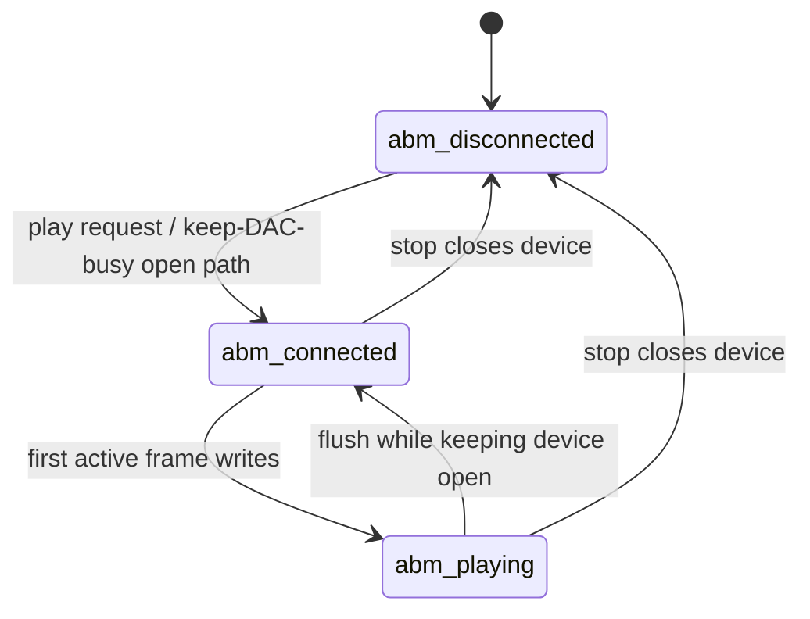
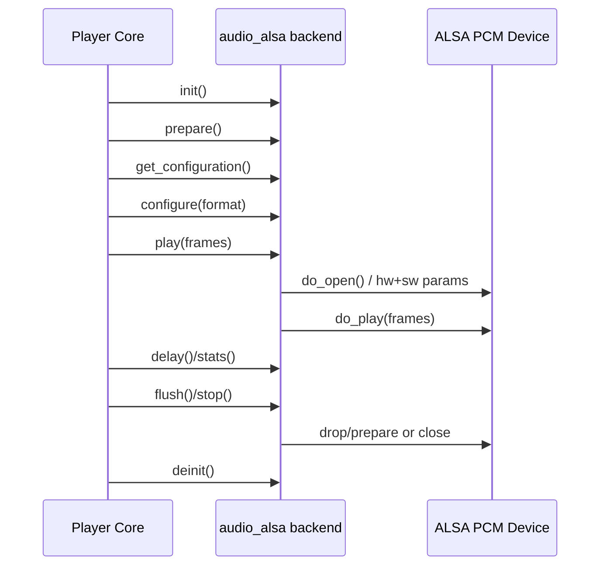

# ALSA Audio Backend Flow

## File

- Source file: [audio_alsa.c](../audio_alsa.c)
- Backend object: [audio_alsa](../audio_alsa.c#L113)

## Purpose

The ALSA backend connects Shairport Sync's player pipeline to Linux ALSA playback.
It is responsible for:

- ALSA device and mixer lifecycle management.
- Probing valid output configurations (format/rate/channels).
- Opening/configuring PCM hardware/software parameters.
- Writing audio frames and recovering from runtime errors.
- Reporting delay and playback statistics for synchronization.
- Optional keep-DAC-busy behavior by writing silence to avoid standby.

## Main Control Surface

The backend exports an audio_output function table:

- init: [init](../audio_alsa.c#L1167)
- deinit: [deinit](../audio_alsa.c#L1623)
- prepare: [prepare](../audio_alsa.c#L1645)
- get_configuration: [get_configuration](../audio_alsa.c#L2420)
- configure: [configure](../audio_alsa.c#L1593)
- start: [start](../audio_alsa.c#L1686)
- play: [play](../audio_alsa.c#L2132)
- flush: [flush](../audio_alsa.c#L2170)
- stop: [stop](../audio_alsa.c#L2184)
- delay/stats: [delay](../audio_alsa.c#L1895), [stats](../audio_alsa.c#L1928)
- volume/mute (when available): [volume](../audio_alsa.c#L2237), [mute](../audio_alsa.c#L2242)

## State Model

Backend state is tracked with:

- abm_disconnected
- abm_connected
- abm_playing

Defined near [alsa_backend_state](../audio_alsa.c#L43).

## Possible Transitions

This state machine uses only the transitions below; any other direct transition is invalid.

States used here:

- `abm_disconnected`: ALSA device is not open for playout.
- `abm_connected`: ALSA device is open/prepared but not actively writing frames.
- `abm_playing`: active frame writes are in progress.

| From | Event / Guard | To | Side Effect |
|---|---|---|---|
| `abm_disconnected` | play request or keep-DAC-busy path opens device | `abm_connected` | ALSA device open/configure/prepare |
| `abm_connected` | first active frame writes begin | `abm_playing` | playout starts |
| `abm_playing` | flush path while keeping device open | `abm_connected` | buffers/timing drained or reset |
| `abm_connected` | stop path closes device | `abm_disconnected` | ALSA handle close |
| `abm_playing` | stop path closes device | `abm_disconnected` | playout stop and ALSA handle close |

Invalid direct transitions (must not happen):

- `abm_disconnected -> abm_playing` without open/configure.
- `abm_playing -> abm_disconnected` without stop/close path.
- `abm_connected -> abm_connected` as a logical transition (steady connected state while idle).

## Startup and Configuration Flow

1. [init](../audio_alsa.c#L1167)
- Sets backend defaults (mmap policy, stall limits, standby behavior).
- Reads configuration options and CLI overrides.
- Starts [alsa_buffer_monitor_thread_code](../audio_alsa.c#L2256).

2. [prepare](../audio_alsa.c#L1645)
- Calls [get_permissible_configuration_settings](../audio_alsa.c#L242).
- Builds a compatibility table for channel/rate/format combinations.

3. [get_configuration](../audio_alsa.c#L2420)
- Verifies output device availability.
- Selects best compatible encoded format through the shared chooser.

4. [configure](../audio_alsa.c#L1593)
- Re-opens ALSA if output format changed.
- Exposes channel map string when available.

## Device Open Path

Open sequence is split across:

- [do_open](../audio_alsa.c#L2051)
- [actual_open_alsa_device](../audio_alsa.c#L690)

Key actions:

- Open PCM handle (fallback from default to hw:0 in a specific access case).
- Choose access method: mmap write or RW write.
- Apply channels, sample format, sample rate.
- Apply optional period and buffer sizing.
- Enable timestamps and prepare the device.
- Select delay engine (standard or precision timing).
- Restore mixer volume/mute state if available.

## Mixer and Volume/Mute Path

Mixer setup is prepared via:

- [prepare_mixer](../audio_alsa.c#L1046)
- [open_mixer](../audio_alsa.c#L624)

Volume/mute handling:

- External volume requests call [volume](../audio_alsa.c#L2237) -> [do_volume](../audio_alsa.c#L2194).
- External mute requests call [mute](../audio_alsa.c#L2242) -> [set_mute_state](../audio_alsa.c#L1647).
- Hardware mute is used only when available and allowed by configuration.

## Playback and Error Recovery

Playback path:

- [play](../audio_alsa.c#L2132) ensures open state and calls [do_play](../audio_alsa.c#L1972).
- [do_play](../audio_alsa.c#L1972) writes frames and updates counters.

Recovery behavior:

- Handles underrun (EPIPE) via snd_pcm_recover.
- Handles suspended stream (ESTRPIPE) via resume/prepare.
- Tracks discontinuities using frames_sent_break_occurred.
- Flags unfixable conditions through [handle_unfixable_error](../audio_alsa.c#L203).

## Delay and Synchronization Data

Delay engines:

- Standard: [standard_delay_and_status](../audio_alsa.c#L1696).
- Precision timestamp aware: [precision_delay_and_status](../audio_alsa.c#L1725).

Public reporting entry points:

- [delay](../audio_alsa.c#L1895)
- [stats](../audio_alsa.c#L1928)

Precision mode can account for elapsed frames since last driver timestamp update and includes DAC stall observation logic.

## Keep-DAC-Busy Background Thread

Thread entry:

- [alsa_buffer_monitor_thread_code](../audio_alsa.c#L2256)

Behavior:

- Waits for keep_dac_busy mode.
- Ensures a valid default output format for silence generation.
- Opens/closes device based on backend state and mode transitions.
- Periodically checks queue depth and writes silence when below threshold.
- Disables standby mode behavior if error rates become excessive.

## Shutdown

- [flush](../audio_alsa.c#L2170) drops/prepares stream unless keep_dac_busy is active.
- [stop](../audio_alsa.c#L2184) closes device unless keep_dac_busy is active.
- [deinit](../audio_alsa.c#L1623) closes device, cancels monitor thread, joins it, and frees backend resources.

## Short Sequence Diagram

## Concurrency Notes

- PCM critical sections are guarded by alsa_mutex.
- Mixer operations are guarded by alsa_mixer_mutex.
- Some routines disable thread cancellation while performing sensitive ALSA operations.

## Practical Reading Order

1. [audio_alsa](../audio_alsa.c#L113)
2. [init](../audio_alsa.c#L1167)
3. [prepare](../audio_alsa.c#L1645)
4. [get_configuration](../audio_alsa.c#L2420)
5. [configure](../audio_alsa.c#L1593)
6. [do_open](../audio_alsa.c#L2051) and [actual_open_alsa_device](../audio_alsa.c#L690)
7. [play](../audio_alsa.c#L2132) and [do_play](../audio_alsa.c#L1972)
8. [delay](../audio_alsa.c#L1895) and [stats](../audio_alsa.c#L1928)
9. [flush](../audio_alsa.c#L2170), [stop](../audio_alsa.c#L2184), [deinit](../audio_alsa.c#L1623)
