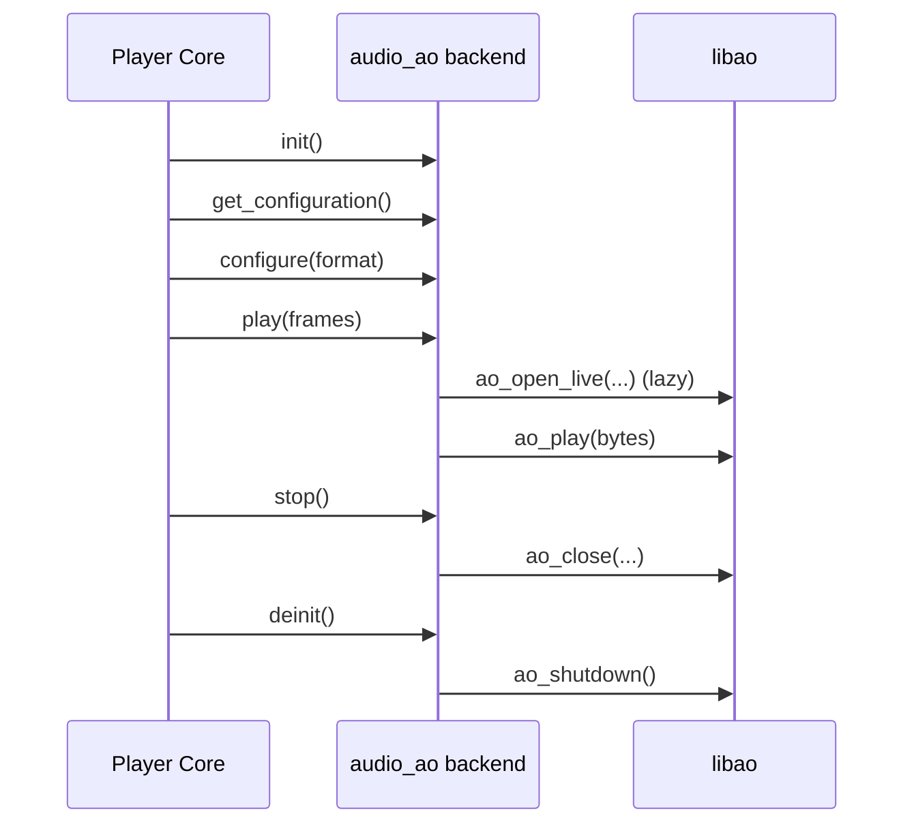

# AO Audio Backend Flow

## File

- Source file: [audio_ao.c](../audio_ao.c)
- Backend object: [audio_ao](../audio_ao.c#L324)

## Purpose

The AO backend connects Shairport Sync output to libao.
It provides a lightweight output path that:

- Selects a valid format/rate/channel combination.
- Configures libao sample format metadata.
- Opens a libao live device on demand.
- Streams PCM frames to libao.
- Closes and tears down libao resources cleanly.

Unlike ALSA-specific backend code, this backend delegates most device details to libao and does not expose backend delay, stats, flush, or software volume/mute hooks.

## Main Control Surface

The backend exports these callbacks through [audio_ao](../audio_ao.c#L324):

- help: [help](../audio_ao.c#L191)
- init: [init](../audio_ao.c#L222)
- deinit: [deinit](../audio_ao.c#L290)
- get_configuration: [get_configuration](../audio_ao.c#L109)
- configure: [configure](../audio_ao.c#L118)
- play: [play](../audio_ao.c#L297)
- stop: [stop](../audio_ao.c#L316)

Not provided in this backend:

- flush, delay, stats, volume, mute (all NULL in [audio_ao](../audio_ao.c#L324)).

## Format Mapping and Capability Checks

Supported internal format mappings are defined in [format_lookup](../audio_ao.c#L42):

- SPS_FORMAT_S16_LE -> 16-bit little-endian
- SPS_FORMAT_S16_BE -> 16-bit big-endian
- SPS_FORMAT_S32_LE -> 32-bit little-endian
- SPS_FORMAT_S32_BE -> 32-bit big-endian

Mapping helper:

- [sps_format_lookup](../audio_ao.c#L48)

Capability probe path:

- [check_settings](../audio_ao.c#L66) builds an ao_sample_format and attempts ao_open_live.
- [check_configuration](../audio_ao.c#L105) adapts signature for the shared chooser.
- [get_configuration](../audio_ao.c#L109) calls search_for_suitable_configuration and logs elapsed time.

## Initialization Flow

[init](../audio_ao.c#L222):

1. Calls ao_initialize and picks default driver with ao_default_driver_id.
2. Sets backend timing defaults in global config.
3. Loads audio option sets from config via parse_audio_options.
4. Parses command-line options:
- -d selects libao driver by short name.
- -i appends id option.
- -n appends both dev and dsp names.
- -o appends arbitrary key=value option.

## Configuration Flow

[configure](../audio_ao.c#L118):

1. Detects requested format change against current_encoded_output_format.
2. Closes existing libao device if open.
3. Builds [ao_output_format](../audio_ao.c#L62) from encoded format:
- bits
- rate
- channels
- byte format
4. Assigns channel matrix strings for 2, 6, and 8 channel layouts.
5. Leaves device unopened; actual open is deferred to play().

Note: channel_map output is not returned (set to NULL when successful).

## Playback Flow

[play](../audio_ao.c#L297):

1. Lazy-opens device with ao_open_live if needed.
2. Calls ao_play with byte count computed from samples * bits/8 * channels.
3. Disables cancellation around ao_play call.

This backend keeps the playback loop minimal and relies on libao for sink-specific handling.

## Stop and Shutdown

- [stop](../audio_ao.c#L316) closes open device and clears handle.
- [deinit](../audio_ao.c#L290) closes any remaining device and calls ao_shutdown.

## Short Sequence Diagram

## Practical Reading Order

1. [audio_ao](../audio_ao.c#L324)
2. [format_lookup](../audio_ao.c#L42) and [sps_format_lookup](../audio_ao.c#L48)
3. [check_settings](../audio_ao.c#L66)
4. [get_configuration](../audio_ao.c#L109)
5. [configure](../audio_ao.c#L118)
6. [play](../audio_ao.c#L297)
7. [stop](../audio_ao.c#L316) and [deinit](../audio_ao.c#L290)
