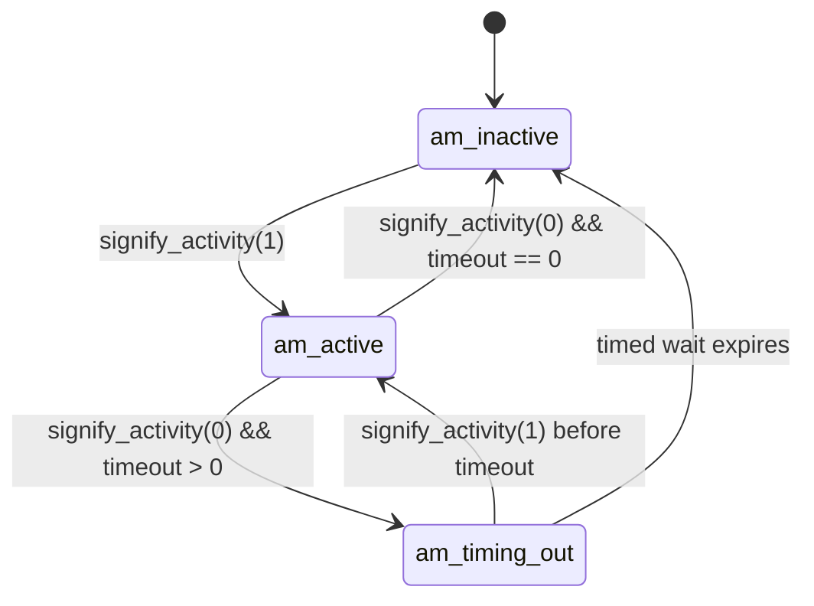

# Activity Monitor: Purpose and Flow

## Purpose

The activity monitor subsystem tracks whether playback is considered active, and controls side effects when activity starts or ends.

It provides:

- A state machine with three states: `am_inactive`, `am_active`, `am_timing_out`.
- Immediate activation/deactivation handling for selected transitions.
- Optional delayed transition to inactive using `config.active_state_timeout`.
- Integration hooks for scripts, metadata, D-Bus active status, and standby/DAC behavior.

Primary implementation:

- `activity_monitor.c`
- `activity_monitor.h`

## Why It Exists

Playback activity transitions need two behaviors at once:

1. Immediate responsiveness when playback starts.
2. Optional grace period before declaring playback inactive.

The monitor centralizes those rules and ensures the "active/inactive" side effects are executed consistently.

## State Model

States:

- `am_inactive`: currently inactive.
- `am_active`: currently active.
- `am_timing_out`: inactive signal received, waiting for timeout before final deactivation.

Player input states used internally:

- `ps_active`
- `ps_inactive`

### Possible Transitions

This state machine uses only the transitions below; any other direct transition is invalid.

States used here:

- `am_inactive`: currently inactive.
- `am_active`: currently active.
- `am_timing_out`: waiting for inactivity timeout to expire.

| From | Event / Guard | To | Side Effect |
|---|---|---|---|
| `am_inactive` | `signify_activity(1)` | `am_active` | `going_active(config.cmd_blocking)` |
| `am_active` | `signify_activity(0)` and `active_state_timeout == 0` | `am_inactive` | `going_inactive(config.cmd_blocking)` |
| `am_active` | `signify_activity(0)` and `active_state_timeout > 0` | `am_timing_out` | start timeout wait |
| `am_timing_out` | `signify_activity(1)` before timeout | `am_active` | no state-change side effect |
| `am_timing_out` | timeout expires while still inactive | `am_inactive` | `going_inactive(0)` |

Invalid direct transitions (must not happen):

- `am_inactive -> am_timing_out`
- `am_timing_out -> am_timing_out` as a logical state transition (it remains waiting in the same state loop)
- `am_active -> am_active` as a logical transition (it remains active while waiting for inactivity)

## Core Flow

### 1) Startup

- `activity_monitor_start()` creates the monitor thread.
- The thread initializes mutex/condition variable.
- Initial state is set to inactive (`am_inactive` + `ps_inactive`).

### 2) Signaling Activity Changes

`activity_monitor_signify_activity(int active)` is called by playback/control paths:

- Updates internal player state (`ps_active` or `ps_inactive`).
- Performs immediate transition work in two important cases:
  - Inactive -> Active: executes `going_active(...)` immediately.
  - Active -> Inactive when timeout is zero: executes `going_inactive(...)` immediately.
- Signals condition variable so thread state machine can continue processing.

Immediate execution is intentional so optional attached scripts can run in blocking mode when configured.

### 3) Background State Machine Thread

`activity_monitor_thread_code(...)` loops forever with mutex held:

- `am_inactive`:
  - Waits until player becomes active.
- `am_active`:
  - Waits until player becomes inactive.
  - If still not already inactive, switches to `am_timing_out` and computes wake-up timeout.
- `am_timing_out`:
  - Waits with timeout.
  - If activity resumes before timeout: return to `am_active`.
  - If timeout expires: transition to `am_inactive` and execute `going_inactive(0)`.

### 4) Side Effects on Transitions

`going_active(block)`:

- Executes `config.cmd_active_start` if configured.
- Emits metadata event `abeg` when metadata support is enabled.
- Sets D-Bus active property true when D-Bus service is running.
- In auto standby mode, sets `config.keep_dac_busy = 1`.

`going_inactive(block)`:

- Executes `config.cmd_active_stop` if configured.
- Emits metadata event `aend` when metadata support is enabled.
- Sets D-Bus active property false when D-Bus service is running.
- In auto standby mode, sets `config.keep_dac_busy = 0`.

### 5) Shutdown

`activity_monitor_stop()`:

- If currently active or timing out, forces inactive side effects first.
- Cancels and joins monitor thread.
- Thread cleanup destroys condition variable and mutex.

## Integration Points In Shairport Sync

- Global lifecycle:
  - Started from `shairport.c` during main startup.
  - Stopped from `shairport.c` in `exit_function()`.

- Playback/session events:
  - RTSP handlers call `activity_monitor_signify_activity(1)` on start/resume paths.
  - RTSP handlers call `activity_monitor_signify_activity(0)` on pause/stop/end paths.

This keeps active/inactive behavior aligned with AirPlay control and transport events.

## Quick Reference

Initialization:

1. `activity_monitor_start()`
2. monitor thread enters `am_inactive`

On playback start/resume:

1. `activity_monitor_signify_activity(1)`
2. possible immediate `going_active(config.cmd_blocking)`
3. state remains/returns `am_active`

On playback pause/stop:

1. `activity_monitor_signify_activity(0)`
2. if timeout is 0 -> immediate `going_inactive(config.cmd_blocking)`
3. if timeout > 0 -> enter `am_timing_out`, then either:
   - become active again if playback resumes, or
   - timeout to `am_inactive` and run `going_inactive(0)`

## Key Functions

- `activity_monitor_start`
- `activity_monitor_stop`
- `activity_monitor_signify_activity`
- `activity_monitor_thread_code`
- `going_active`
- `going_inactive`

## Navigation Anchors

- `activity_monitor.c`: `going_active`, `going_inactive`, `activity_monitor_signify_activity`, `activity_monitor_thread_code`, `activity_monitor_start`, `activity_monitor_stop`.
- `shairport.c`: activity monitor start/stop lifecycle calls.
- `rtsp.c`: activity transitions from transport/control events via `activity_monitor_signify_activity`.
