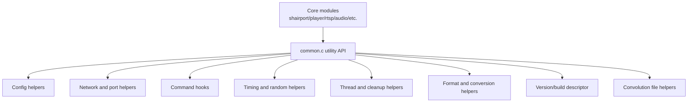
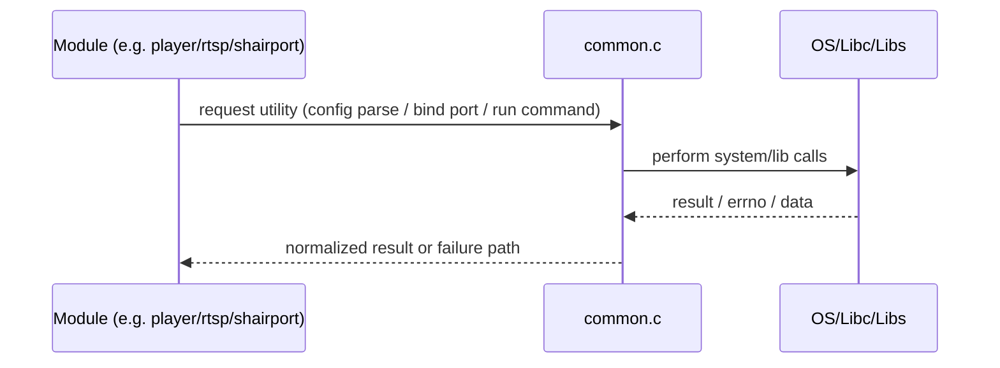

# Common Utilities Flow

## Scope
This note describes the purpose and execution flow of [common.c](common.c), which provides shared infrastructure used across Shairport Sync modules.

## Purpose
[common.c](common.c) is the cross-cutting utility layer. It centralizes reusable logic for:

1. format/rate metadata helpers
2. socket/port and filesystem utilities
3. config parsing helpers (libconfig wrappers)
4. command-hook execution (start/stop/volume/custom commands)
5. volume-to-attenuation transfer functions
6. timing, randomness, and byte-order conversion
7. cleanup helpers for cancellation-safe resource handling
8. thread creation/naming/priority helpers
9. version string composition
10. optional convolution IR parsing and validation

This file is not a single linear runtime path; it is a library of utilities invoked by many subsystems.

## High-Level Architecture

## Functional Flow by Utility Group

### 1. Format and Rate Helpers
- `sps_format_sample_size(...)`, `sps_format_description_string(...)`, `sps_rate_actual_rate(...)`, `short_format_description(...)`
- Flow:
  1. caller provides enum/encoded format
  2. helper maps to byte-size/rate/text
  3. caller uses result for buffer sizing, logs, or diagnostics

### 2. Port Allocation and Socket Binding
- `resetFreeUDPPort()`, `nextFreeUDPPort()`, `bind_socket_and_port(...)`, `bind_UDP_port(...)`
- Flow:
  1. initialize/reset UDP candidate state
  2. pick a candidate port inside configured range
  3. attempt bind, retry on `EADDRINUSE`
  4. resolve actual bound port with `getsockname`
  5. return bound socket and selected port or fail with detailed diagnostics

### 3. Filesystem and Error Text Utilities
- `getErrorText(...)`, `do_mkdir(...)`, `mkpath(...)`
- Flow:
  1. detect whether directories exist
  2. create missing path components top-down
  3. return precise errno-oriented status for callers

### 4. Config Value Normalization Helpers
- `config_lookup_non_empty_string(...)`, `config_set_lookup_bool(...)`
- `config_get_string_settings_as_string_array(...)`, `config_get_int_settings_as_int_array(...)`
- `check_string_or_list_setting(...)`, `check_int_or_list_setting(...)`
- `service_type_to_string(...)`, `string_to_service_type(...)`
- Flow:
  1. caller looks up raw setting(s)
  2. helper validates type and value shape
  3. helper normalizes into a stable C representation (string/bool/array/enums)
  4. helper warns/dies on invalid inputs depending on severity

### 5. Command Hook Execution Path
- `command_set_volume(...)`, `command_start(...)`, `command_execute(...)`, `command_stop(...)`
- Flow:
  1. assemble command line (optionally with extra argument)
  2. fork child process
  3. parse argv with `poptParseArgvString`
  4. `execv` target program in child
  5. parent optionally blocks via `waitpid`
  6. optional start-hook stdout capture can feed backend selection

### 6. Volume Transfer Functions
- `flat_vol2attn(...)`, `dasl_tapered_vol2attn(...)`, `vol2attn(...)`
- Flow:
  1. accept AirPlay volume domain (0.0 to -30.0, plus mute sentinel)
  2. map to device attenuation range (min/max dB*100)
  3. return profile-specific attenuation result
  4. provide guard behavior for invalid ranges

### 7. Time, Sleep, Randomness, and Endian Conversion
- `get_monotonic_time_in_ns()`, `get_realtime_in_ns()`, `get_absolute_time_in_ns()`
- `sps_nanosleep(...)`
- `raninit(...)`, `r64init(...)`, `r64u()`, `r64i()`
- `nctohl(...)`, `nctohs(...)`, `nctoh64(...)`
- Flow:
  1. choose platform-appropriate clock source
  2. expose nanosecond timestamps for synchronization logic
  3. provide deterministic PRNG state for dither/silence generation paths
  4. safely decode network-order integers without aliasing violations

### 8. Cleanup and Resource Safety Helpers
- `malloc_cleanup(...)`, `socket_cleanup(...)`, `cv_cleanup(...)`, `mutex_cleanup(...)`, `thread_cleanup(...)`, unlock helpers
- Flow:
  1. registered via pthread cleanup patterns by callers
  2. invoked on cancellation/error paths
  3. ensure locks, sockets, threads, and allocations are released consistently

### 9. Device Identity and Version Descriptor
- `get_device_id(...)`, `get_version_string()`
- Flow:
  1. probe interfaces for first suitable non-loopback MAC address
  2. retry for bounded time window if no interface is ready
  3. compose runtime version string including enabled feature tags and `SYSCONFDIR`

### 10. Thread Creation and Naming Helpers
- `do_pthread_setname(...)`, `named_pthread_create(...)`, `named_pthread_create_with_priority(...)`
- Flow:
  1. construct bounded thread name
  2. create thread (optionally with RT scheduling attributes)
  3. gracefully fall back to normal scheduling if RT setup fails
  4. apply thread name where supported

### 11. Convolution IR File Helpers (Optional Build)
- `parse_ir_filenames(...)`, `sanity_check_ir_files(...)`, `free_ir_filenames(...)`
- Flow:
  1. parse quoted/unquoted comma-separated filenames
  2. validate each file with libsndfile and record metadata
  3. report problems early, free all allocated filename storage safely

## Important Design Characteristics

1. Platform abstraction:
- Many utilities branch on Linux/BSD/macOS compile paths.

2. Fail-fast behavior:
- Configuration/type errors often produce warnings or hard failures close to source.

3. Cancellation and thread hygiene:
- Multiple helpers are designed to keep pthread cancellation and cleanup predictable.

4. Shared global state:
- The global `config` object and related utility state are intentionally centralized here for broad access.

## Typical Call Relationship

## Function Index (Function → Caller Modules)

| Function (common.c) | Primary caller modules (examples) | Typical purpose at call site |
|---|---|---|
| [config_lookup_non_empty_string](common.c#L1023) | [shairport.c](shairport.c#L645), [audio_alsa.c](audio_alsa.c#L1231), [audio_pa.c](audio_pa.c#L503), [audio_jack.c](audio_jack.c#L199), [audio_sndio.c](audio_sndio.c#L401) | Read optional non-empty string config values safely |
| [config_set_lookup_bool](common.c#L1045) | [shairport.c](shairport.c#L654), [shairport.c](shairport.c#L1413) | Normalize yes/no style config settings into booleans |
| [string_to_service_type](common.c#L1251) | [shairport.c](shairport.c#L646), [shairport.c](shairport.c#L1534) | Convert service type text into internal enum |
| [bind_UDP_port](common.c#L427) | [rtp.c](rtp.c#L1096), [rtp.c](rtp.c#L1098), [rtp.c](rtp.c#L1100) | Allocate and bind RTP/RTCP/timing UDP sockets |
| [bind_socket_and_port](common.c#L365) | [common.h](common.h#L587) | Shared helper for explicit bind with resolved bound port |
| [get_absolute_time_in_ns](common.c#L1664) | [rtp.c](rtp.c#L216), [shairport.c](shairport.c#L239), [audio_alsa.c](audio_alsa.c#L247), [audio_jack.c](audio_jack.c#L363), [dacp.c](dacp.c#L212) | High-resolution monotonic timing for sync, pacing, and diagnostics |
| [get_monotonic_time_in_ns](common.c#L1607) | [common.h](common.h#L522) | NTP-disciplined monotonic timestamp access |
| [named_pthread_create](common.c#L2315) | [shairport.c](shairport.c#L3389), [rtp.c](rtp.c#L711), [ap2_buffered_audio_processor.c](ap2_buffered_audio_processor.c#L159), [dacp.c](dacp.c#L991), [tinysvcmdns.c](tinysvcmdns.c#L1753) | Create worker threads with standardized naming |
| [named_pthread_create_with_priority](common.c#L2334) | [audio_alsa.c](audio_alsa.c#L1507) | Create RT-priority helper thread with fallback |
| [command_start](common.c#L1331) | [player.c](player.c), [common.h](common.h#L548) | Execute start hook and optionally consume output |
| [command_stop](common.c#L1441) | [player.c](player.c), [common.h](common.h#L549) | Execute stop hook on session end |
| [vol2attn](common.c#L1546) | [audio_alsa.c](audio_alsa.c), [audio_pa.c](audio_pa.c), [common.h](common.h#L514) | Map AirPlay volume to backend attenuation range |
| [get_version_string](common.c#L1874) | [shairport.c](shairport.c#L172), [shairport.c](shairport.c#L2169), [shairport.c](shairport.c#L2747) | Build runtime feature/version descriptor string |
| [get_device_id](common.c#L2221) | [shairport.c](shairport.c#L2439) | Discover MAC-derived device identity |
| [parse_ir_filenames](common.c#L2407) | [shairport.c](shairport.c#L1291), [shairport.c](shairport.c#L1295) | Parse convolution IR filename list |
| [free_ir_filenames](common.c#L2605) | [shairport.c](shairport.c#L2014) | Release parsed convolution filename structures |

## Why This File Matters
[common.c](common.c) is a foundational dependency for many subsystems. Changes here propagate widely into startup behavior, command hooks, networking setup, synchronization timing, and robustness of cleanup paths.