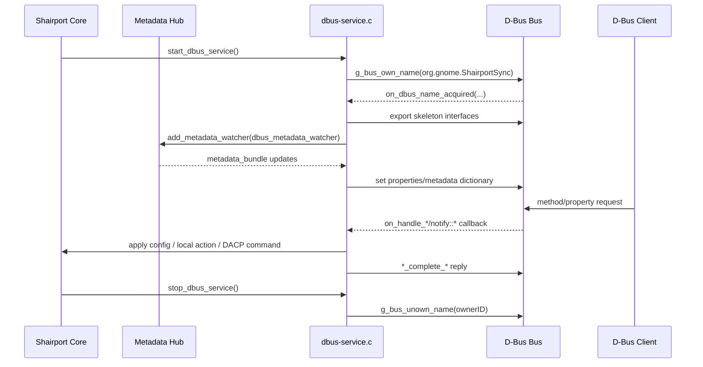

# D-Bus Service Flow (`dbus-service.c`)

## Purpose

`dbus-service.c` is the runtime bridge between Shairport Sync internals and the native D-Bus API (`org.gnome.ShairportSync`).

It does three jobs:

1. **Publishes D-Bus objects and properties** for status, diagnostics and remote control.
2. **Accepts incoming D-Bus commands** and forwards them into local control paths and (for Classic AirPlay) DACP commands.
3. **Mirrors internal playback/metadata state out to D-Bus** by watching metadata updates and setting exported properties.

## Main Components

The file manages four generated GDBus skeleton objects:

1. `ShairportSync` (core controls and properties)
2. `ShairportSyncDiagnostics` (verbosity/statistics/log formatting controls)
3. `ShairportSyncRemoteControl` (transport and volume remote methods)
4. `ShairportSyncAdvancedRemoteControl` (advanced controls/properties)

## Startup Flow

Entry point: `start_dbus_service()`.

1. Chooses bus type from configuration (`system` or `session`).
2. Calls `g_bus_own_name(...)` for `org.gnome.ShairportSync`.
3. When ownership is acquired, `on_dbus_name_acquired(...)` runs.
4. `on_dbus_name_acquired(...)`:
   - Creates all four skeletons.
   - Exports each at `/org/gnome/ShairportSync`.
   - Connects property notification handlers (`notify::*`) to config-mutating callbacks.
   - Connects D-Bus method handlers (`handle-*`) to command callbacks.
   - Registers `dbus_metadata_watcher(...)` with metadata hub via `add_metadata_watcher(...)`.
   - Seeds initial property values from current config/runtime state.
   - Marks service running.

If name acquisition fails, `on_dbus_name_lost(...)` logs and clears ownership tracking.

## Runtime Data Flow

### A. Internal state -> D-Bus

Path: metadata hub -> `dbus_metadata_watcher(...)` -> skeleton properties.

`dbus_metadata_watcher(...)` receives a `metadata_bundle` and updates:

1. Player/network/session status (client, availability, stream type).
2. Position/timing strings (progress, frame positions).
3. Transport state (`PlayerState`, playback, loop, shuffle).
4. Rich metadata dictionary (`a{sv}`) including title, album, artist, composer, genre, art URL, track ID, duration.

To reduce churn, many setters are only called when value changes.

### B. D-Bus property changes -> core config

`notify_*` callbacks validate incoming values and either:

1. Apply to live config (e.g. verbosity, drift tolerance, loudness threshold, interpolation mode), or
2. Reject and restore current value back into the D-Bus property.

Conditional compile blocks preserve behavior when features are absent (e.g. convolution support).

### C. D-Bus method calls -> actions

`on_handle_*` callbacks service method invocations:

1. Local actions (`DropSession`, frame position update interval, quit request).
2. DACP passthrough commands for Classic AirPlay remote control (`play`, `pause`, next/previous, volume commands, repeat/shuffle updates).

Each handler completes the DBus invocation via `*_complete_*`.

## Shutdown Flow

Entry point: `stop_dbus_service()`.

1. If ownership exists, call `g_bus_unown_name(ownerID)`.
2. Reset service running flag.

`dbus_service_is_running()` returns this running flag.

## Key Functions

1. `dbus_metadata_watcher(...)`: central outbound state sync.
2. `on_handle_remote_command(...)`: generic DACP command tunnel with hex response encoding.
3. `on_dbus_name_acquired(...)`: service bootstrap and signal wiring hub.
4. `start_dbus_service()` / `stop_dbus_service()`: lifecycle entry points.

## High-Level Sequence Diagram

