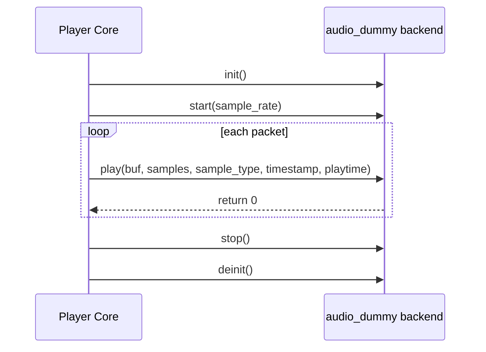

# Dummy Audio Backend Flow

## File

- Source file: [audio_dummy.c](../audio_dummy.c)
- Backend object: [audio_dummy](../audio_dummy.c#L70)

## Purpose

The dummy backend is a no-op audio output implementation used for testing, debugging, and demonstrating timing metadata flow without sending audio to real hardware.

It primarily:

- Accepts playback callbacks from the player.
- Logs startup and stop events.
- Optionally logs lead-time for timed frames.
- Always reports successful playback.

## Main Control Surface

Callbacks exposed through [audio_dummy](../audio_dummy.c#L70):

- init: [init](../audio_dummy.c#L38)
- deinit: [deinit](../audio_dummy.c#L40)
- start: [start](../audio_dummy.c#L42)
- play: [play](../audio_dummy.c#L55)
- stop: [stop](../audio_dummy.c#L68)

Not implemented in this backend (set to NULL):

- help, configure, is_running, flush, delay, stats, volume, parameters, mute.

## Lifecycle Flow

1. [init](../audio_dummy.c#L38)
- Takes backend args and returns success immediately.

2. [start](../audio_dummy.c#L42)
- Logs the negotiated sample rate.

3. [play](../audio_dummy.c#L55)
- Ignores audio buffer contents and sample count.
- If frame type is timed, computes lead time as:
  - lead_time = playtime - current_absolute_time_ns
- Logs timestamp and lead time for diagnostics.
- Returns success (0).

4. [stop](../audio_dummy.c#L68)
- Logs stop event.

5. [deinit](../audio_dummy.c#L40)
- No teardown required.

## Timing Metadata Notes

The play callback comments describe the meaning of:

- sample_type: timed or untimed frames.
- timestamp: RTP timestamp of first frame.
- playtime: scheduled playback time in local monotonic nanoseconds.

See explanatory comments around [play](../audio_dummy.c#L55).

## Short Sequence Diagram

## Practical Reading Order

1. [audio_dummy](../audio_dummy.c#L70)
2. [init](../audio_dummy.c#L38)
3. [start](../audio_dummy.c#L42)
4. [play](../audio_dummy.c#L55)
5. [stop](../audio_dummy.c#L68)
6. [deinit](../audio_dummy.c#L40)
