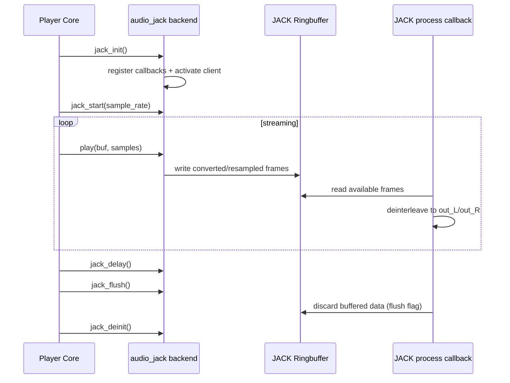

# JACK Audio Backend Flow

## File

- Source file: [audio_jack.c](../audio_jack.c)
- Backend object: [audio_jack](../audio_jack.c#L432)

## Purpose

This backend connects Shairport Sync audio output to a JACK graph.
It is designed around JACK realtime constraints and uses a lock-free ringbuffer between:

- Producer side: Shairport Sync play callback.
- Consumer side: JACK process callback.

Core responsibilities:

- Initialize/activate JACK client and output ports.
- Optionally autoconnect output ports to matching JACK inputs.
- Transfer audio into a JACK ringbuffer from non-realtime code.
- Read/deinterleave ringbuffer data in JACK realtime callback.
- Estimate output delay from latency + ringbuffer occupancy.
- Optionally resample with soxr when enabled.

## Main Control Surface

Callbacks exported by [audio_jack](../audio_jack.c#L432):

- init: [jack_init](../audio_jack.c#L180)
- deinit: [jack_deinit](../audio_jack.c#L310)
- start: [jack_start](../audio_jack.c#L326)
- flush: [jack_flush](../audio_jack.c#L347)
- delay: [jack_delay](../audio_jack.c#L353)
- play: [play](../audio_jack.c#L383)

Not implemented in this backend:

- help, configure, stop, stats, volume, parameters, mute.

## Data Path Architecture

1. Producer path (non-realtime): [play](../audio_jack.c#L383)
- Converts incoming interleaved 16-bit samples to JACK float format.
- Optional soxr resampling to JACK sample rate.
- Writes converted frames into lock-free ringbuffer.

2. Consumer path (realtime): [process](../audio_jack.c#L113)
- Called by JACK for each processing cycle.
- Reads available frames from ringbuffer using read vectors.
- Deinterleaves into per-port JACK buffers via [deinterleave](../audio_jack.c#L94).
- Fills missing frames with silence on underflow.

This decouples Shairport timing from JACK callback timing while preserving realtime safety in the process callback.

## Initialization Flow

[jack_init](../audio_jack.c#L180):

1. Sets backend timing defaults and interpolation threshold.
2. Restricts backend audio options to 44.1kHz, 16-bit LE, 2 channels via parse_audio_options.
3. Reads JACK-specific settings:
- jack.client_name
- jack.autoconnect_pattern
- jack.soxr_resample_quality (if built with soxr)
- jack.bufsz
4. Creates and mlocks ringbuffer.
5. Opens JACK client and checks JACK sample rate policy.
6. Registers callbacks:
- [process](../audio_jack.c#L113)
- [graph](../audio_jack.c#L160)
- [error](../audio_jack.c#L176)
- [info](../audio_jack.c#L179)
7. Registers output ports and activates client.
8. Optionally autoconnects each output port to matching input ports.

## Runtime Flow

### Start

[jack_start](../audio_jack.c#L326):

- Records current Shairport sample rate.
- Creates or recreates soxr resampler when resampling is enabled.

### Play

[play](../audio_jack.c#L383):

- Acquires producer-side mutex.
- Gets ringbuffer write vectors.
- Writes converted/resampled frames.
- Advances ringbuffer write pointer.
- Updates transfer timestamp for delay estimation.
- Warns on overrun (dropped samples).

### Process Callback

[process](../audio_jack.c#L113):

- Gets JACK per-port output buffers.
- Handles pending flush request by advancing ringbuffer read pointer.
- Reads up to requested frames from ringbuffer vectors.
- Deinterleaves into L/R output buffers.
- Advances read pointer.
- Zero-fills remaining JACK frames if insufficient data.

### Graph Callback and Latency Baseline

[graph](../audio_jack.c#L160):

- Recomputes output latency range for each port.
- Stores average maximum latency in jack frames.

### Delay Reporting

[jack_delay](../audio_jack.c#L353):

- Reads ringbuffer occupancy and elapsed time since last producer transfer.
- Computes delay in JACK frames:
  - jack_latency + occupancy - frames_already_consumed
- Converts delay to Shairport sample-rate frames.

### Flush

[jack_flush](../audio_jack.c#L347):

- Sets a flag requesting process callback to discard buffered audio.
- Flush happens in realtime-safe context inside process callback.

## Shutdown

[jack_deinit](../audio_jack.c#L310):

- Deactivates and closes JACK client.
- Frees ringbuffer.
- Destroys soxr state if present.

## Concurrency and Realtime Notes

- [client_mutex](../audio_jack.c#L46) guards client lifecycle operations.
- [buffer_mutex](../audio_jack.c#L45) guards producer-side ringbuffer writes and delay bookkeeping.
- Process callback does not take mutexes and avoids blocking operations.
- Ringbuffer is mlocked to avoid paging and reduce realtime jitter risk.

## Short Sequence Diagram

## Practical Reading Order

1. [audio_jack](../audio_jack.c#L432)
2. [jack_init](../audio_jack.c#L180)
3. [process](../audio_jack.c#L113) and [deinterleave](../audio_jack.c#L94)
4. [play](../audio_jack.c#L383)
5. [graph](../audio_jack.c#L160)
6. [jack_delay](../audio_jack.c#L353)
7. [jack_flush](../audio_jack.c#L347)
8. [jack_deinit](../audio_jack.c#L310)
