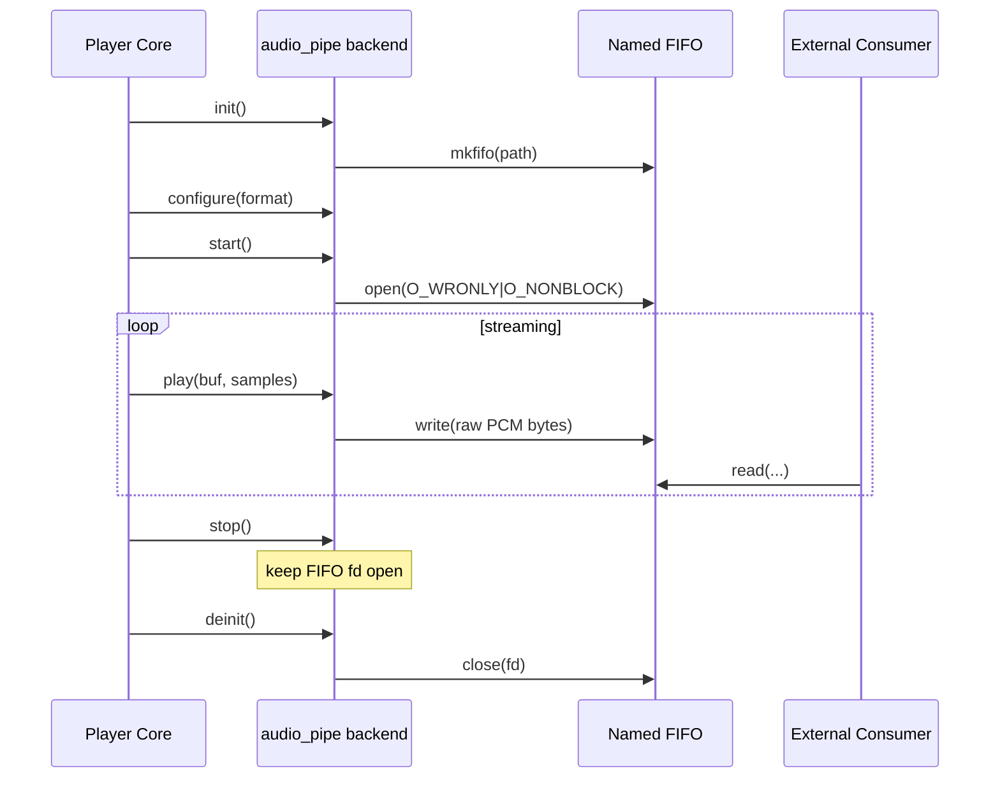

# Pipe Audio Backend Flow

## File

- Source file: [audio_pipe.c](../audio_pipe.c)
- Backend object: [audio_pipe](../audio_pipe.c#L178)

## Purpose

This backend writes decoded PCM frames to a named FIFO (pipe) instead of a hardware or software audio server.

It is useful for:

- Forwarding Shairport Sync audio into external processes.
- Debugging or integrating with custom audio pipelines.
- Simple file/stream-style consumers that can read a FIFO.

## Main Control Surface

Callbacks exported by [audio_pipe](../audio_pipe.c#L178):

- help: [help](../audio_pipe.c#L154)
- init: [init](../audio_pipe.c#L101)
- deinit: [deinit](../audio_pipe.c#L152)
- get_configuration: [get_configuration](../audio_pipe.c#L158)
- configure: [configure](../audio_pipe.c#L165)
- start: [start](../audio_pipe.c#L51)
- play: [play](../audio_pipe.c#L73)
- stop: [stop](../audio_pipe.c#L97)

Not implemented in this backend:

- is_running, flush, delay, stats, volume, parameters, mute.

## Runtime Model

1. Pipe endpoint state
- FIFO path in [pipename](../audio_pipe.c#L48), defaulting to [default_pipe_name](../audio_pipe.c#L49).
- Writer file descriptor in [fd](../audio_pipe.c#L44).

2. Frame size state
- [bytes_per_frame](../audio_pipe.c#L46) is set in [configure](../audio_pipe.c#L165).
- play() uses this to compute write size from sample count.

## Initialization Flow

[init](../audio_pipe.c#L101):

1. Sets backend defaults for buffer length and latency offset.
2. Parses backend audio options with fixed defaults:
- AirPlay 2 build: 48kHz, S32_LE, 2ch.
- Non-AirPlay 2 build: 44.1kHz, S16_LE, 2ch.
3. Resolves pipe name from config (`pipe.name`) and/or command-line argument.
4. Rejects special value `STDOUT` for this backend.
5. Falls back to `/tmp/shairport-sync-audio` if none supplied.
6. Creates FIFO with mkfifo (ignores EEXIST).

## Configuration Flow

[get_configuration](../audio_pipe.c#L158):

- Uses generic `search_for_suitable_configuration(...)` without backend-specific checks.

[configure](../audio_pipe.c#L165):

1. Derives bytes per sample from encoded output format.
2. Computes `bytes_per_frame = bytes_per_sample * channels`.
3. Returns EINVAL only if format size is unknown (with fallback size used internally).

## Start and Write Flow

[start](../audio_pipe.c#L51):

- Attempts non-blocking open of FIFO for writing.
- Treats ENXIO as non-fatal (no reader attached yet).
- Logs warning only for other open errors.

[play](../audio_pipe.c#L73):

1. If FIFO is not open, retries opening it.
2. If open, computes bytes to write from sample count and `bytes_per_frame`.
3. Writes raw PCM bytes directly to FIFO.
4. Suppresses repeated warning spam by logging non-EPIPE write errors once.

Behavior with no reader:

- Open may keep failing with ENXIO until a consumer opens the FIFO.
- play() keeps returning success while retrying open/write opportunistically.

## Stop and Shutdown

[stop](../audio_pipe.c#L97):

- Intentionally does not close FIFO between play sessions.

[deinit](../audio_pipe.c#L152):

- Closes writer file descriptor safely.

## Error Handling Notes

- ENXIO on open is expected when no reader is attached.
- EPIPE on write is treated as expected disconnect behavior.
- Other write/open errors are logged.

## Short Sequence Diagram

## Practical Reading Order

1. [audio_pipe](../audio_pipe.c#L178)
2. [init](../audio_pipe.c#L101)
3. [get_configuration](../audio_pipe.c#L158)
4. [configure](../audio_pipe.c#L165)
5. [start](../audio_pipe.c#L51)
6. [play](../audio_pipe.c#L73)
7. [stop](../audio_pipe.c#L97)
8. [deinit](../audio_pipe.c#L152)
