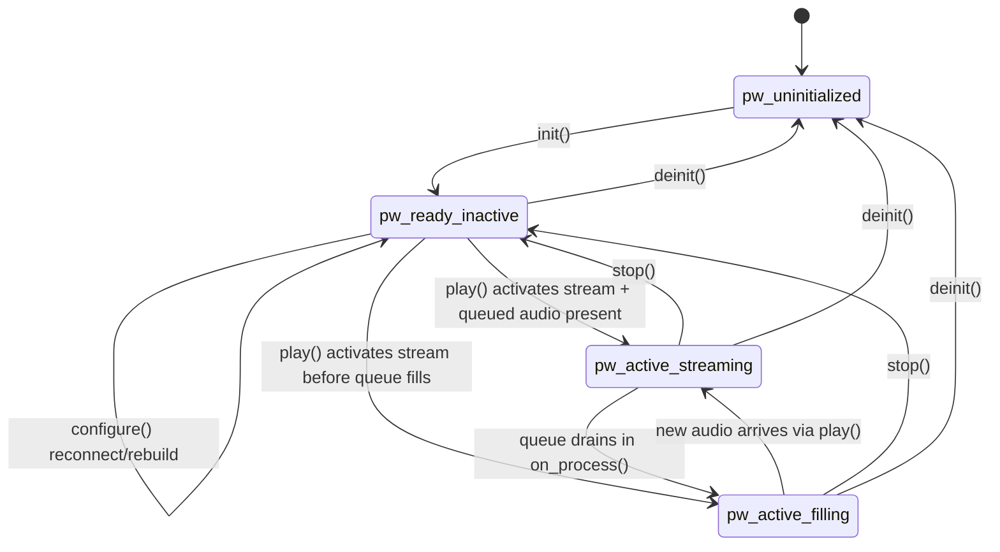
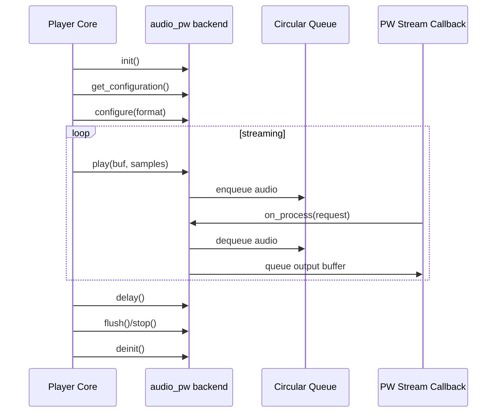

# PipeWire Audio Backend Flow

## See Also

- [PulseAudio-Audio-Backend-Flow.md](PulseAudio-Audio-Backend-Flow.md)
- [ALSA-Audio-Backend-Flow.md](ALSA-Audio-Backend-Flow.md)
- [JACK-Audio-Backend-Flow.md](JACK-Audio-Backend-Flow.md)
- [Pipe-Audio-Backend-Flow.md](Pipe-Audio-Backend-Flow.md)
- [Dummy-Audio-Backend-Flow.md](Dummy-Audio-Backend-Flow.md)
- [AO-Audio-Backend-Flow.md](AO-Audio-Backend-Flow.md)
- [README.md](README.md)

## File

- Source file: [audio_pw.c](../audio_pw.c)
- Backend object: [audio_pw](../audio_pw.c#L657)

## Purpose

The PipeWire backend sends Shairport Sync output to PipeWire using a threaded loop and a callback-driven stream.

Main responsibilities:

- Initialize PipeWire loop/stream and backend-specific properties.
- Select a supported output format/rate/channel configuration.
- Reconfigure and reconnect the stream when output format changes.
- Buffer player audio in an internal circular queue.
- Feed PipeWire in the realtime process callback.
- Report effective output delay from PipeWire timing + local queue occupancy.
- Handle flush/stop by clearing queued audio and deactivating stream.

## Main Control Surface

Callbacks exported by [audio_pw](../audio_pw.c#L657):

- init: [init](../audio_pw.c#L188)
- deinit: [deinit](../audio_pw.c#L173)
- get_configuration: [get_configuration](../audio_pw.c#L289)
- configure: [configure](../audio_pw.c#L293)
- play: [play](../audio_pw.c#L507)
- delay: [delay](../audio_pw.c#L550)
- flush: [flush](../audio_pw.c#L630)
- stop: [stop](../audio_pw.c#L641)

Not implemented here:

- help, start, is_running, stats, volume, parameters, mute.

## Internal Data Model

1. Format mapping table [format_lookup](../audio_pw.c#L58)
- Restricts backend-supported formats to S16_LE, S16_BE, S32_LE, S32_BE.

2. Circular software queue
- Backing memory pointers: audio_lmb/audio_umb.
- Queue head/tail: audio_toq/audio_eoq.
- Occupancy tracking: audio_occupancy.
- Protected by [buffer_mutex](../audio_pw.c#L66).

3. PipeWire runtime handles
- Thread loop + stream are held in global [data](../audio_pw.c#L84).
- Stream callback is [on_process](../audio_pw.c#L99).

4. Runtime flags
- `stream_is_active`: whether stream is currently marked active.
- `on_process_is_running`: whether realtime callback is observed running.
- `enable_fill`: allows silence filling while queue is empty.

## Backend State Model

This backend has an implicit lifecycle state machine based on stream connectivity/activity and queue state.

States used here:

- `pw_uninitialized`: PipeWire loop/stream not set up.
- `pw_ready_inactive`: loop/stream exist, stream connected but inactive/corked equivalent.
- `pw_active_streaming`: stream active and process callback is consuming queued audio.
- `pw_active_filling`: stream active but queue empty, process callback writes silence.

## Possible Transitions



| From | Event / Guard | To | Side Effect |
|---|---|---|---|
| `pw_uninitialized` | `init()` | `pw_ready_inactive` | initialize PipeWire, create loop+stream |
| `pw_ready_inactive` | `configure()` | `pw_ready_inactive` | disconnect/reconnect stream and rebuild queue |
| `pw_ready_inactive` | `play()` with activation | `pw_active_streaming` | mark stream active and enqueue audio |
| `pw_ready_inactive` | `play()` then callback before data | `pw_active_filling` | active callback emits silence |
| `pw_active_streaming` | queue empty in callback | `pw_active_filling` | callback switches to silence output |
| `pw_active_filling` | `play()` enqueues audio | `pw_active_streaming` | callback resumes real audio transfer |
| `pw_active_streaming` | `stop()` | `pw_ready_inactive` | deactivate stream and clear queue |
| `pw_active_filling` | `stop()` | `pw_ready_inactive` | deactivate stream and clear queue |
| any active/ready | `deinit()` | `pw_uninitialized` | stop loop, destroy stream/loop, free queue |

Invalid transitions (must not happen):

- `pw_uninitialized -> pw_active_streaming` without `init()`.
- `pw_uninitialized -> pw_ready_inactive` via `configure()` alone.
- `pw_ready_inactive -> pw_uninitialized` except through `deinit()`.

## Initialization Flow

[init](../audio_pw.c#L188):

1. Sets backend defaults (desired buffer length, interpolation threshold, latency offset).
2. Parses audio options for `pipewire` stanza and backend-level options.
3. Loads optional PipeWire properties:
- `pipewire.application_name`
- `pipewire.node_name`
- `pipewire.sink_target`
4. Calls `pw_init(...)`.
5. Creates threaded loop and stream with properties.
6. Starts thread loop and leaves stream inactive until first playback.

## Configuration Discovery

- [check_settings](../audio_pw.c#L265) validates only format family compatibility for this backend.
- [check_configuration](../audio_pw.c#L285) adapts chooser signature.
- [get_configuration](../audio_pw.c#L289) delegates selection to shared `search_for_suitable_configuration(...)`.

## Stream Configuration Flow

[configure](../audio_pw.c#L293):

1. If format changed, updates `current_encoded_output_format`.
2. Maps SPS format to PipeWire format/bytes-per-sample.
3. Locks PipeWire loop and disconnects current stream if connected.
4. Reallocates one-second circular queue sized to active rate/channels/format.
5. Builds `spa_audio_info_raw` with explicit channel positions for 1..8 channels.
6. Connects output stream with:
- `PW_STREAM_FLAG_AUTOCONNECT`
- `PW_STREAM_FLAG_MAP_BUFFERS`
- `PW_STREAM_FLAG_RT_PROCESS`
7. Resets active/fill flags and unlocks loop.
8. Returns channel map string for caller when requested.

Invariant (retry safety):

- A failed `pw_stream_connect(...)` must not leave backend state appearing configured for that format.
- On connect failure, configured-format state is reset so a subsequent request for the same format still takes the reconfigure path.
- This behavior is locked by regression coverage in [tests/test_audio_pw_safety.c](../tests/test_audio_pw_safety.c) (`test_configure_retry_semantics_after_connect_failure`).

## Playback Flow

[play](../audio_pw.c#L507):

1. Activates stream on first use (`pw_stream_set_active(..., true)`).
2. Converts samples to bytes for configured frame size.
3. Enqueues bytes into circular queue (bounded by available queue space).
4. Returns immediately; actual device write occurs in callback.

## Realtime Callback Flow

[on_process](../audio_pw.c#L99):

1. Locks queue mutex and marks callback running.
2. Dequeues a PipeWire buffer.
3. Computes writable frames from requested size and buffer maxsize.
4. If queued audio exists:
- copies from ring queue (including wrap-around case),
- updates queue pointers/occupancy,
- writes chunk metadata.
5. If no audio is queued and fill is enabled:
- writes silence frames.
6. Queues PipeWire buffer back.

## Delay Estimation

[delay](../audio_pw.c#L550):

1. Attempts to obtain stable `pw_time` snapshots around queue occupancy sample.
2. Uses PipeWire timing fields (`queued`, `buffered`, `delay`, rate info).
3. Adds local queue frames and fixed-delay conversion.
4. Subtracts frames likely played since measurement timestamp.
5. Returns resulting frame delay estimate for sync control.

## Flush and Stop

- [flush](../audio_pw.c#L630): clears ring queue and enables silence fill.
- [stop](../audio_pw.c#L641): clears ring queue, deactivates stream if active.

## Shutdown

[deinit](../audio_pw.c#L173):

1. Stops thread loop.
2. Destroys stream and loop.
3. Calls `pw_deinit()`.
4. Frees queue memory.

## User Service Setup (PipeWire)

Use this when you want Shairport Sync to run as a **user-level** systemd service with the PipeWire backend.

Example user account in these commands: `user`

### 1) Build with PipeWire support

Configure with PipeWire enabled, then build/install:

```bash
autoreconf -fi
./configure --with-pipewire --with-ssl=openssl --with-avahi --with-systemd-startup
make
sudo make install
```

Check that PipeWire support is present:

```bash
shairport-sync -V | grep -i pipewire
```

### 2) Install user-level service

Run as the target user (not root):

```bash
su - user
cd /path/to/shairport-sync
sh user-service-install.sh
```

This installer creates/enables `~/.config/systemd/user/shairport-sync.service` and, when possible, sets `-o pipewire` in `ExecStart`.

### 3) Enable start at machine boot (before login)

Enable lingering for the user:

```bash
sudo loginctl enable-linger user
```

Verify:

```bash
loginctl show-user user -p Linger
```

Expected result: `Linger=yes`

### 4) Verify service state

As user `user`:

```bash
systemctl --user daemon-reload
systemctl --user enable --now shairport-sync.service
systemctl --user status shairport-sync.service
```

### 5) Useful troubleshooting checks

Check PipeWire user service:

```bash
systemctl --user status pipewire
```

Check user-service logs:

```bash
journalctl --user -u shairport-sync.service -b
```

Check for conflict with system-level service (disable if enabled):

```bash
sudo systemctl disable --now shairport-sync
```

## Short Sequence Diagram



## Practical Reading Order

1. [audio_pw](../audio_pw.c#L657)
2. [init](../audio_pw.c#L188)
3. [check_settings](../audio_pw.c#L265) and [get_configuration](../audio_pw.c#L289)
4. [configure](../audio_pw.c#L293)
5. [play](../audio_pw.c#L507)
6. [on_process](../audio_pw.c#L99)
7. [delay](../audio_pw.c#L550)
8. [flush](../audio_pw.c#L630), [stop](../audio_pw.c#L641), [deinit](../audio_pw.c#L173)
