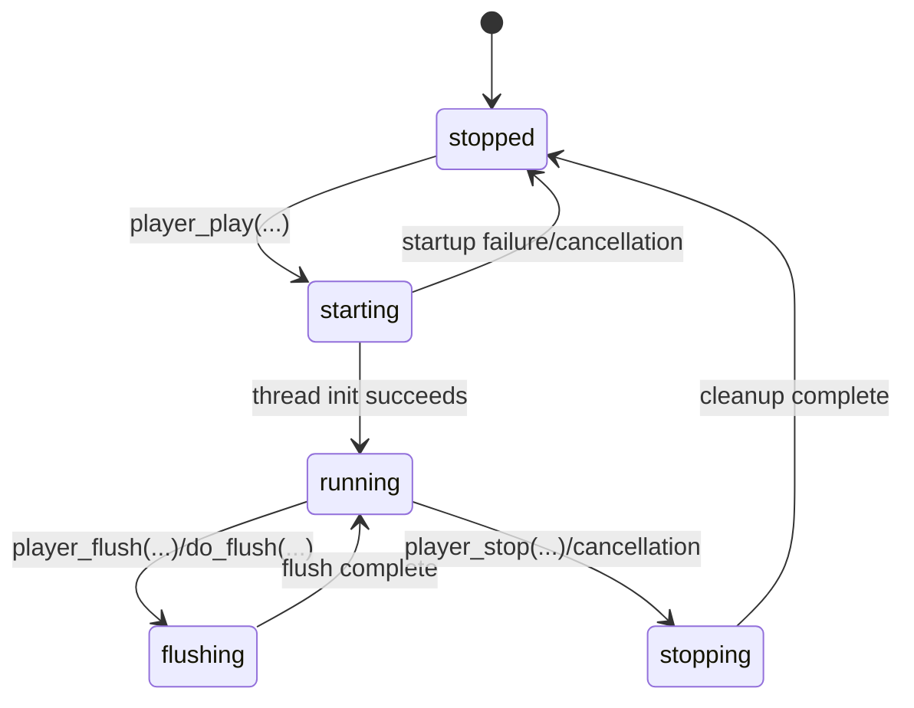
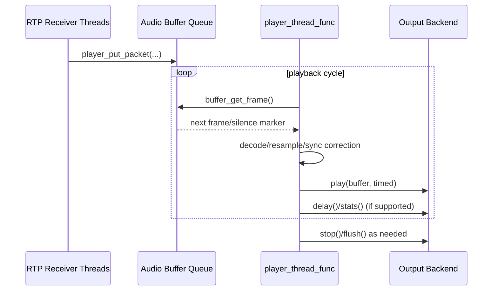

# Player Flow

## File

- Source file: [player.c](../player.c)

## Purpose

This file is the core audio playout engine for Shairport Sync.
It sits between RTP packet reception and the selected output backend, and is responsible for:

- Packet queueing and reorder handling.
- Missing-packet detection and resend requests.
- Decode/transcode pipeline setup (ALAC/AAC, FFmpeg and non-FFmpeg paths).
- Synchronization against timing anchors and output delay.
- Frame stuffing/skipping/silence insertion for sync correction.
- Optional DSP stages (loudness, convolution) and dither/output formatting.
- Runtime volume/mute policy and metadata/statistics reporting.

## Major Entry Points

- Packet ingestion: [player_put_packet](../player.c#L1454)
- Playback loop thread: [player_thread_func](../player.c#L3472)
- Playback thread startup: [player_play](../player.c#L5279)
- Playback thread stop/teardown: [player_stop](../player.c#L5312)
- Flush request: [player_flush](../player.c#L5262) and [do_flush](../player.c#L5252)
- Volume policy application: [player_volume_without_notification](../player.c#L5025), [player_volume](../player.c#L5247)

## High-Level Runtime Flow

1. Session startup
- [player_play](../player.c#L5279) prepares backend (if supported) and spawns player thread.
- [player_thread_func](../player.c#L3472) initializes decoder/buffers/state and starts RTP worker threads.

2. Packet arrival path
- RTP receiver threads pass decoded packet payloads into [player_put_packet](../player.c#L1454).
- Packet metadata and payload are inserted into ring-style audio buffer slots.
- Missing ranges are tracked and resend requests are emitted when timing gates allow.

3. Frame release path
- Player loop calls [buffer_get_frame](../player.c#L2037) to obtain the next timed frame.
- This stage handles buffering gates, flush windows, stale-frame drops, and lead-in silence priming.

4. Decode/resample path
- FFmpeg builds/updates decode + SWR chains using [prepare_decoding_chain](../player.c#L1044) and [setup_software_resampler](../player.c#L528).
- Decoded AVFrames are converted to output-oriented interleaved PCM via [avframe_to_audio](../player.c#L1166).
- Non-FFmpeg ALAC path decodes directly into PCM packet buffers.

5. Sync and correction path
- Player computes sync error from timing anchor vs output delay measurements.
- Applies correction decisions: frame stuffing/removal, initial frame skipping, or inserted silence.
- Buffer shaping methods include [stuff_buffer_basic_32](../player.c#L2922), [stuff_buffer_vernier](../player.c#L2992), and optional [stuff_buffer_soxr_32](../player.c#L3140).

6. Output and telemetry
- Output backend gets timed play calls from the player loop.
- Statistics/metadata are periodically emitted (sync, rates, occupancy, resend metrics).
- Volume and mute state are enforced by [player_volume_without_notification](../player.c#L5025).

7. Shutdown
- [player_stop](../player.c#L5312) cancels/joins player thread.
- Cleanup handler [player_thread_cleanup_handler](../player.c#L3332) stops backend, terminates worker threads, and frees decode/buffer resources.

## Possible Transitions

This state machine uses only the transitions below; any other direct transition is invalid.

States used here:

- `stopped`: no active player thread.
- `starting`: startup path is running, backend and thread resources are being prepared.
- `running`: player loop is active and can consume/emit audio frames.
- `flushing`: flush has been requested; buffered timing/data is being reset.
- `stopping`: stop/teardown is in progress.

| From | Event / Guard | To | Side Effect |
|---|---|---|---|
| `stopped` | `player_play(...)` called successfully | `starting` | backend prepare/startup path begins |
| `starting` | player thread initialized successfully | `running` | RTP workers active; playout loop begins |
| `starting` | startup failure/cancellation | `stopped` | partial resources released |
| `running` | `player_flush(...)` / `do_flush(...)` | `flushing` | queued frame/timing windows reset |
| `flushing` | flush work complete | `running` | normal playout resumes from fresh buffer context |
| `running` | `player_stop(...)` or cancellation | `stopping` | worker cancellation, backend stop, cleanup begin |
| `stopping` | cleanup complete | `stopped` | thread joined and resources freed |

Invalid direct transitions (must not happen):

- `stopped -> running` without startup path.
- `running -> stopped` without stop/cleanup path.
- `flushing -> stopped` unless stop is explicitly requested (otherwise flush returns to running).

## Buffering and Resend Logic

- Buffer slots are initialized/reset by [ab_resync](../player.c#L152) and [reset_buffer](../player.c#L340).
- Occupancy introspection: [get_audio_buffer_occupancy](../player.c#L356).
- In [player_put_packet](../player.c#L1454), missing packet runs are detected in sequence space and resend requests are rate-limited by timing checks.
- When a frame is irretrievably missing at playout time, the player substitutes silence to preserve timing continuity.

## Timing and Synchronization Model

- Packet timestamps are converted to local playout time using anchor/timing helpers invoked in the player loop.
- Backend latency feedback (if backend supports delay) is incorporated before deciding release timing.
- Persistent out-of-bound sync error windows can trigger resync behavior.

## Volume and Mute Policy

- [player_volume_without_notification](../player.c#L5025) computes hardware/software attenuation split.
- Supports three modes: software-only, hardware-only, or combined range extension.
- Honors mute semantics, optional hardware mute, and volume control profile mapping.

## Sequence Diagram

## Practical Reading Order

1. [player_play](../player.c#L5279)
2. [player_thread_func](../player.c#L3472)
3. [player_put_packet](../player.c#L1454)
4. [buffer_get_frame](../player.c#L2037)
5. [setup_software_resampler](../player.c#L528) and [prepare_decoding_chain](../player.c#L1044)
6. [avframe_to_audio](../player.c#L1166)
7. [stuff_buffer_basic_32](../player.c#L2922), [stuff_buffer_vernier](../player.c#L2992), [stuff_buffer_soxr_32](../player.c#L3140)
8. [player_volume_without_notification](../player.c#L5025)
9. [player_stop](../player.c#L5312) and [player_thread_cleanup_handler](../player.c#L3332)
