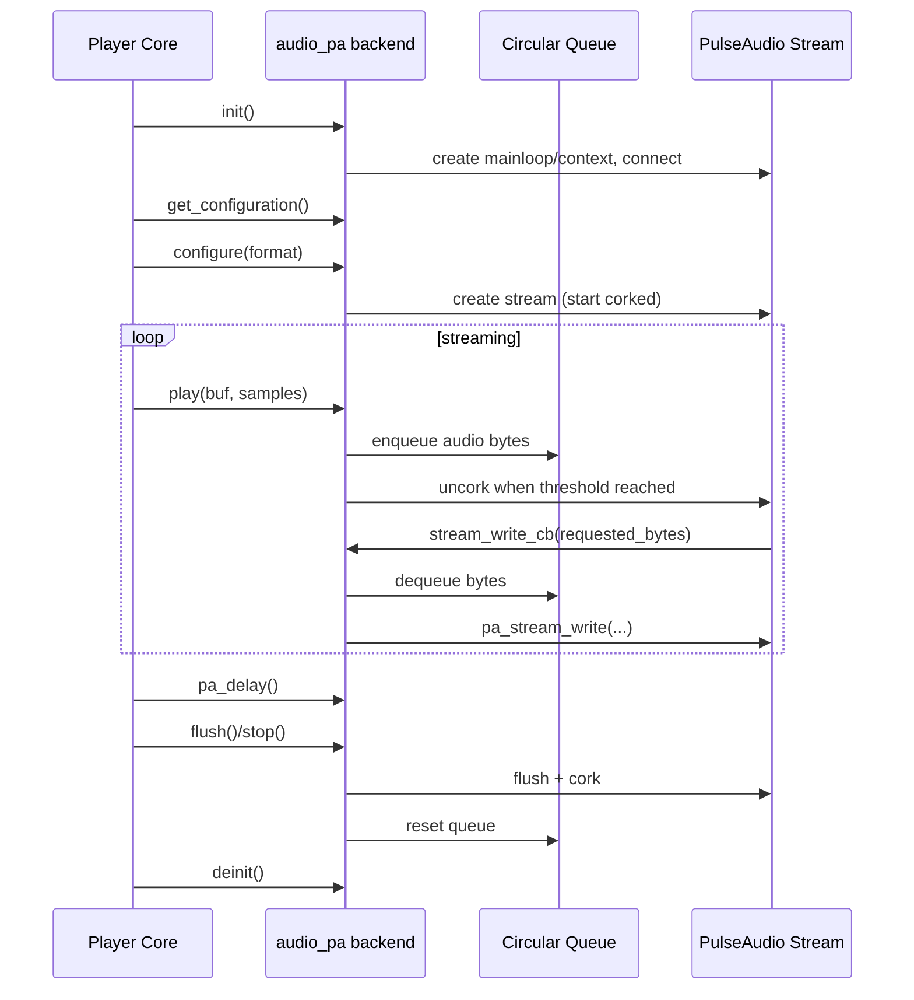

# PulseAudio Audio Backend Flow

## See Also

- [PipeWire-Audio-Backend-Flow.md](PipeWire-Audio-Backend-Flow.md)
- [ALSA-Audio-Backend-Flow.md](ALSA-Audio-Backend-Flow.md)
- [JACK-Audio-Backend-Flow.md](JACK-Audio-Backend-Flow.md)
- [Pipe-Audio-Backend-Flow.md](Pipe-Audio-Backend-Flow.md)
- [Dummy-Audio-Backend-Flow.md](Dummy-Audio-Backend-Flow.md)
- [AO-Audio-Backend-Flow.md](AO-Audio-Backend-Flow.md)
- [README.md](README.md)

## File

- Source file: [audio_pa.c](../audio_pa.c)
- Backend object: [audio_pa](../audio_pa.c#L779)

## Purpose

This backend connects Shairport Sync output to PulseAudio using the asynchronous PulseAudio API and a threaded mainloop.

Main responsibilities:

- Initialize PulseAudio mainloop and context.
- Probe and select supported format/rate/channel configurations.
- Create/recreate a playback stream for the active format.
- Buffer incoming audio in an internal circular queue.
- Feed PulseAudio in the stream write callback.
- Report end-to-end delay estimate from queue occupancy + PulseAudio stream latency.
- Handle flush/stop by corking and clearing queued audio.

## Main Control Surface

Callbacks exported by [audio_pa](../audio_pa.c#L779):

- init: [init](../audio_pa.c#L479)
- deinit: [deinit](../audio_pa.c#L577)
- get_configuration: [get_configuration](../audio_pa.c#L160)
- configure: [configure](../audio_pa.c#L169)
- play: [play](../audio_pa.c#L595)
- delay: [pa_delay](../audio_pa.c#L641)
- flush: [flush](../audio_pa.c#L669)
- stop: [stop](../audio_pa.c#L688)

Not implemented here:

- help, start, is_running, stats, volume, parameters, mute.

## Internal Data Model

1. Format mapping table [format_lookup](../audio_pa.c#L46)
- Maps Shairport sample format to PulseAudio sample format and bytes per sample.

2. Circular software queue
- Backing memory pointers: audio_lmb/audio_umb.
- Queue head/tail: audio_toq/audio_eoq.
- Occupancy tracking: audio_occupancy.
- Protected by [buffer_mutex](../audio_pa.c#L54).

3. PulseAudio core handles
- [mainloop](../audio_pa.c#L56), [context](../audio_pa.c#L58), [stream](../audio_pa.c#L59).

## Initialization Flow

[init](../audio_pa.c#L479):

1. Sets backend defaults for desired buffer length and interpolation threshold.
2. Parses backend audio options and PulseAudio-specific config fields:
- pulseaudio.server
- pulseaudio.default_channel_layouts
- pulseaudio.application_name
- pulseaudio.sink
3. Creates threaded mainloop and context.
4. Installs [context_state_cb](../audio_pa.c#L708).
5. Starts mainloop, connects context, and waits until context reaches READY.

## Configuration Discovery

Format probing path:

- [check_settings](../audio_pa.c#L117) attempts temporary stream creation for a candidate format.
- [check_configuration](../audio_pa.c#L156) adapts signature for generic chooser.
- [get_configuration](../audio_pa.c#L160) calls search_for_suitable_configuration and returns best match.

## Stream Configuration Flow

[configure](../audio_pa.c#L169):

1. If format changed, tears down prior stream (flush/cork/disconnect/unref).
2. Allocates a one-second internal circular buffer sized for active format/rate/channels.
3. Chooses channel map policy:
- ALSA-style defaults first (or explicit alsa policy).
- PulseAudio defaults fallback.
- Extended defaults fallback.
4. Builds a public channel map string when requested.
5. Creates playback stream and registers callbacks:
- [stream_state_cb](../audio_pa.c#L713)
- [stream_write_cb](../audio_pa.c#L718)
6. Connects playback to configured sink or default sink.
7. Waits for stream to reach READY.

Stream starts corked and is uncorked later by play logic once enough queued audio has accumulated.

## Playback Flow

[play](../audio_pa.c#L595):

1. Converts frame count to transfer bytes for current format.
2. Enqueues bytes into the circular buffer (bounded by available space).
3. If queue occupancy reaches threshold (about 1/4 second) and stream is corked, uncorks stream.

This function does not write directly to PulseAudio stream memory; actual stream writes are pull-driven by PulseAudio callback.

## Stream Write Callback Flow

[stream_write_cb](../audio_pa.c#L718):

1. Called by PulseAudio when writable bytes are requested.
2. Pulls bytes from circular queue while data remains and request is unsatisfied.
3. Uses pa_stream_begin_write + pa_stream_write.
4. Handles wrap-around reads from circular queue.
5. Decrements queue occupancy accordingly.
6. Can cork stream when queue empties.

## Delay Estimation

[pa_delay](../audio_pa.c#L641):

- Queries PulseAudio stream latency in microseconds.
- Converts queue occupancy bytes to frames.
- Converts PulseAudio latency to frames.
- Returns combined delay in source frames:
  - queued_frames + stream_latency_frames

## Flush and Stop

Both [flush](../audio_pa.c#L669) and [stop](../audio_pa.c#L688):

1. If stream is active and uncorked, flush then cork the PulseAudio stream.
2. Reset circular queue pointers and occupancy to empty.

Behavior is similar; both functions clear queued audio and pause output.

## Shutdown

[deinit](../audio_pa.c#L577):

- Disconnects stream.
- Stops and frees threaded mainloop.

## State/Signal Callbacks

- [context_state_cb](../audio_pa.c#L708): signals waiting thread on context state change.
- [stream_state_cb](../audio_pa.c#L713): signals waiting thread on stream state change.
- [stream_success_cb](../audio_pa.c#L773): completion callback placeholder.

## Short Sequence Diagram

## Practical Reading Order

1. [audio_pa](../audio_pa.c#L779)
2. [init](../audio_pa.c#L479)
3. [check_settings](../audio_pa.c#L117) and [get_configuration](../audio_pa.c#L160)
4. [configure](../audio_pa.c#L169)
5. [play](../audio_pa.c#L595)
6. [stream_write_cb](../audio_pa.c#L718)
7. [pa_delay](../audio_pa.c#L641)
8. [flush](../audio_pa.c#L669), [stop](../audio_pa.c#L688), [deinit](../audio_pa.c#L577)
