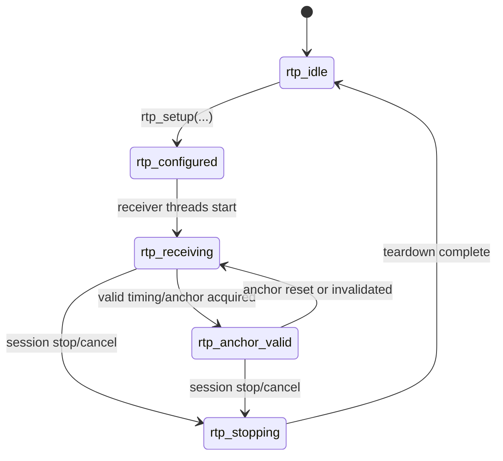
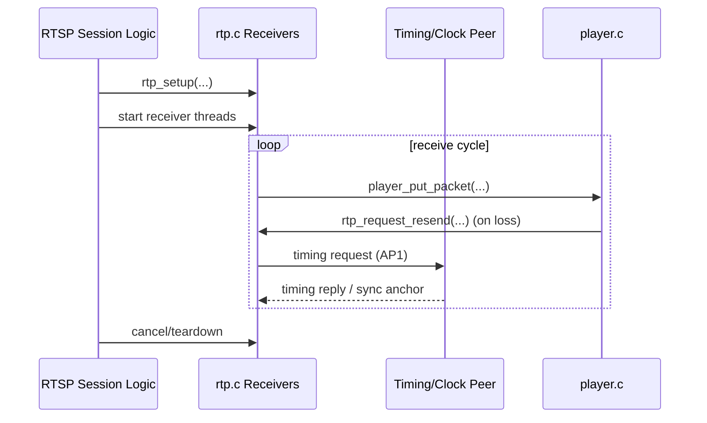

# RTP Protocol Flow

## File

- Source file: [rtp.c](../rtp.c)
- Public interface: [rtp.h](../rtp.h)

## Purpose

This file is the RTP transport and timing layer for Shairport Sync.
It bridges network packet flows and player ingestion, and is responsible for:

- Creating and managing per-session RTP sockets.
- Receiving audio, control, and timing packets.
- Maintaining timing anchors for timestamp-to-local-time conversion.
- Applying sync latency policy from control packets.
- Requesting retransmission of missing packets.
- Supporting both AirPlay 1 style timing (NTP-like exchange) and AirPlay 2 timing (PTP-backed anchor updates).

For the audio playout side that consumes these packets, see [Player-Flow.md](Player-Flow.md).
For the process orchestration that starts the RTP layer, see [Shairport-Main-Flow.md](Shairport-Main-Flow.md).

## Main Control Surface

Core entry points exported by [rtp.h](../rtp.h):

- Session init and teardown: [rtp_initialise](../rtp.c#L152), [rtp_terminate](../rtp.c#L161)
- Socket setup: [rtp_setup](../rtp.c#L997)
- AP1 receivers:
  - [rtp_audio_receiver](../rtp.c#L193)
  - [rtp_control_receiver](../rtp.c#L325)
  - [rtp_timing_receiver](../rtp.c#L703)
- AP1 timing sender helper: [rtp_timing_sender](../rtp.c#L595)
- Resend requests: [rtp_request_resend](../rtp.c#L1183)
- Timestamp conversion API:
  - [frame_to_local_time](../rtp.c#L1854)
  - [local_time_to_frame](../rtp.c#L1861)
  - [have_timestamp_timing_information](../rtp.c#L1875)

AirPlay 2 specific paths (when enabled):

- [rtp_ap2_control_receiver](../rtp.c#L1621)
- [rtp_realtime_audio_receiver](../rtp.c#L1792)
- [set_ptp_anchor_info](../rtp.c#L1276)
- [get_ptp_anchor_local_time_info](../rtp.c#L1356)

## High-Level Runtime Flow

1. Session bootstrap
- [rtp_initialise](../rtp.c#L152) resets resend backoff state and initializes timing mutexes.
- [rtp_setup](../rtp.c#L997) resolves client timing/control addresses, binds local UDP sockets, and marks the RTP session running.

2. Packet receive workers
- RTSP/session orchestration starts receiver threads that run the loops in this file.
- AP1 path uses audio/control/timing sockets.
- AP2 path uses control and realtime-audio sockets and PTP-derived anchors.

3. Audio ingress to player
- AP1 audio packets in [rtp_audio_receiver](../rtp.c#L193):
  - handles normal audio payload type 0x60 and resend payload type 0x56.
  - validates payload length and passes packets to player via player_put_packet.
- AP2 realtime/control audio in [rtp_realtime_audio_receiver](../rtp.c#L1792) and [rtp_ap2_control_receiver](../rtp.c#L1621):
  - decrypts payloads with decipher_player_put_packet.
  - forwards decoded packet payloads to player_put_packet.

4. Control and timing updates
- AP1 control sync packets (0xd4) in [rtp_control_receiver](../rtp.c#L325) update:
  - stream latency,
  - anchor RTP timestamp,
  - anchor remote time validity.
- AP1 timing exchange:
  - [rtp_timing_sender](../rtp.c#L595) sends timing probes (0xd2).
  - [rtp_timing_receiver](../rtp.c#L703) processes replies (0xd3), estimates local-to-remote offset and drift, and refreshes conversion anchors.
- AP2 anchoring in [rtp_ap2_control_receiver](../rtp.c#L1621) and [set_ptp_anchor_info](../rtp.c#L1276) updates PTP-backed anchor state.

5. Timestamp conversion for playout sync
- Conversion calls dispatch by timing type:
  - NTP-like path: [frame_to_ntp_local_time](../rtp.c#L1131), [local_ntp_time_to_frame](../rtp.c#L1158)
  - PTP path: [frame_to_ptp_local_time](../rtp.c#L1510), [local_ptp_time_to_frame](../rtp.c#L1528)
- Generic wrappers expose one API to the player/control path:
  - [frame_to_local_time](../rtp.c#L1854)
  - [local_time_to_frame](../rtp.c#L1861)

6. Loss recovery
- Missing sequence runs discovered in player trigger [rtp_request_resend](../rtp.c#L1183).
- This function sends Apple resend requests and applies short error-backoff after send failures.

## Timing and Anchor Model

Two timing regimes are supported:

- AP1 style: NTP-like timing probe/response and sync packets maintain local-to-remote offset and drift.
- AP2 style: PTP-backed master clock information is combined with anchor announcements to map RTP frames to local playout time.

Anchor validity and reset helpers:

- NTP reset and validity: [reset_ntp_anchor_info](../rtp.c#L1113), [have_ntp_timing_information](../rtp.c#L1121)
- PTP reset and validity: [reset_ptp_anchor_info](../rtp.c#L1347), [have_ptp_timing_information](../rtp.c#L1503)
- Unified reset/validity API: [reset_anchor_info](../rtp.c#L1868), [have_timestamp_timing_information](../rtp.c#L1875)

## Possible Transitions

This state machine uses only the transitions below; any other direct transition is invalid.

States used here:

- `rtp_idle`: RTP transport not set up for this session.
- `rtp_configured`: sockets and remote endpoints are configured.
- `rtp_receiving`: receiver loops are active and ingesting packets.
- `rtp_anchor_valid`: enough timing information exists for reliable timestamp conversion.
- `rtp_stopping`: teardown/cancellation is in progress.

| From | Event / Guard | To | Side Effect |
|---|---|---|---|
| `rtp_idle` | session setup via `rtp_setup(...)` | `rtp_configured` | local UDP sockets bound; peer endpoints recorded |
| `rtp_configured` | receiver threads enter run loops | `rtp_receiving` | audio/control/timing packet handling active |
| `rtp_receiving` | anchor/timing becomes valid | `rtp_anchor_valid` | frame-time conversion can use anchor data |
| `rtp_anchor_valid` | reset or clock/anchor invalidation | `rtp_receiving` | conversion falls back to waiting for fresh timing |
| `rtp_receiving` | stop/cancel requested | `rtp_stopping` | cleanup handlers close sockets/join helpers |
| `rtp_anchor_valid` | stop/cancel requested | `rtp_stopping` | same as above |
| `rtp_stopping` | cleanup complete | `rtp_idle` | session transport state cleared |

Invalid direct transitions (must not happen):

- `rtp_idle -> rtp_receiving` without setup.
- `rtp_configured -> rtp_anchor_valid` before receivers process timing/control packets.
- `rtp_anchor_valid -> rtp_idle` without stop/teardown path.

## Sequence Diagram

## Practical Reading Order

1. [rtp_setup](../rtp.c#L997)
2. [rtp_audio_receiver](../rtp.c#L193)
3. [rtp_control_receiver](../rtp.c#L325)
4. [rtp_timing_sender](../rtp.c#L595) and [rtp_timing_receiver](../rtp.c#L703)
5. [rtp_request_resend](../rtp.c#L1183)
6. AP2: [rtp_ap2_control_receiver](../rtp.c#L1621), [rtp_realtime_audio_receiver](../rtp.c#L1792)
7. Conversion wrappers: [frame_to_local_time](../rtp.c#L1854), [local_time_to_frame](../rtp.c#L1861)
