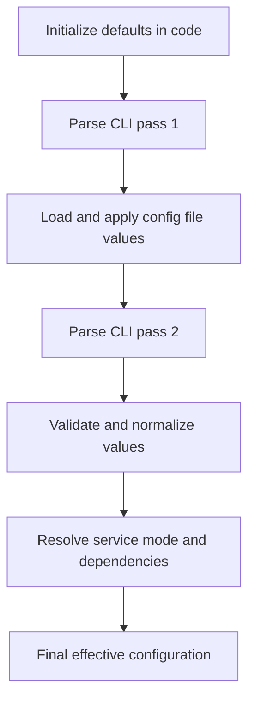

# Shairport Configuration Precedence and Decision Logic

## Scope
This companion note focuses only on how [shairport.c](shairport.c) decides effective runtime settings.

It does not cover full startup/shutdown orchestration, audio pipeline internals, or RTSP packet handling.

## Where This Happens
Most precedence and normalization rules are implemented in `parse_options(int argc, char **argv)` in [shairport.c](shairport.c).

## Precedence Model
Shairport Sync applies settings in this order:

1. Built-in defaults in code
2. Configuration file values (if file exists and parses)
3. Command-line options (highest precedence)

This is explicitly implemented by parsing arguments twice:

- Pass 1: parse enough options for early behavior and initial state
- Configuration load: apply values from config file
- Pass 2: parse command line again and override config values

## Effective Decision Flow

## Concrete Precedence Examples

### Example 1: Audio Backend Selection
- Default: first available backend from `audio_get_output(NULL)`.
- Config file override: `general.output_backend`.
- CLI override: `-o` / `--output`.
- Final use: `audio_get_output(config.output_name)` in `main`.

Result: CLI backend always wins when supplied.

### Example 2: Service Type (auto/classic/airplay2)
- Default: `APST_auto` in `main`.
- Config file override: `general.service_type`.
- CLI override: `--service-type`.
- Post-resolution logic:
  - If AirPlay 2 build and NQPTP is unavailable:
    - `auto` becomes forced classic
    - explicit `airplay2` causes fatal error
  - If NQPTP is available and mode is `auto`, it becomes `airplay2`.

Result: a user-requested mode is still subject to hard runtime capability checks.

### Example 3: Timeout and Session Interruption
- Default timeout initialized in `main`.
- Config file: `sessioncontrol.session_timeout` (and related flags).
- CLI override: `-t` / `--timeout`.
- Normalization rules:
  - `0` means no timeout path and enables corresponding no-timeout behavior.
  - non-zero values below minimum threshold are warned and corrected.

Result: CLI wins, then safety normalization may still adjust invalid values.

### Example 4: Interpolation Mode
- Default depends on build features:
  - with soxr: `auto`
  - without soxr: `vernier`
- Config file override: `general.interpolation`.
- CLI override: `-S` / `--stuffing`.
- Validation:
  - `soxr` requested without soxr support yields warning/fatal depending on path.

Result: selected mode is constrained by compile-time feature availability.

### Example 5: Metadata and Cover Art
- Build-time default when metadata feature is enabled: metadata and cover art on.
- Config file overrides: `metadata.enabled`, `metadata.include_cover_art`.
- CLI controls: `-M`, `-g`.
- Consistency checks:
  - requesting cover art while metadata is disabled is rejected.

Result: precedence applies, then dependency checks enforce coherent configuration.

## Decision Logic Categories
After precedence is applied, [shairport.c](shairport.c) runs a second layer of decision logic:

1. Range validation and normalization
   - numeric ranges for ports, delays, tolerances, timeout values
   - out-of-range values trigger warnings, correction, or fatal errors

2. Feature-gated settings
   - options requiring `CONFIG_SOXR`, `CONFIG_AIRPLAY_2`, etc.
   - unsupported selections are downgraded, warned, or rejected

3. Cross-setting consistency checks
   - mutually dependent settings validated together
   - examples: metadata vs cover art, MQTT vs metadata, daemonization combinations

4. Runtime environment constraints
   - external service availability (notably NQPTP for AirPlay 2)
   - service mode adjusted or aborted based on runtime checks

## Special Cases Worth Remembering
- Command-line options are intentionally parsed twice so CLI keeps highest precedence after config file load.
- "Highest precedence" does not bypass safety checks; invalid combinations can still be changed or rejected.
- Some deprecated options are accepted for compatibility but warned and redirected toward modern settings.

## Practical Operator Rule
For deterministic behavior:

1. Put stable defaults in config file.
2. Use CLI only for temporary overrides.
3. Expect final values to be post-processed by validation, feature gates, and runtime dependency checks.
