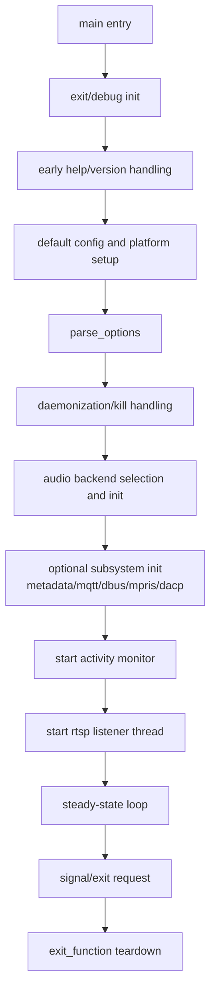
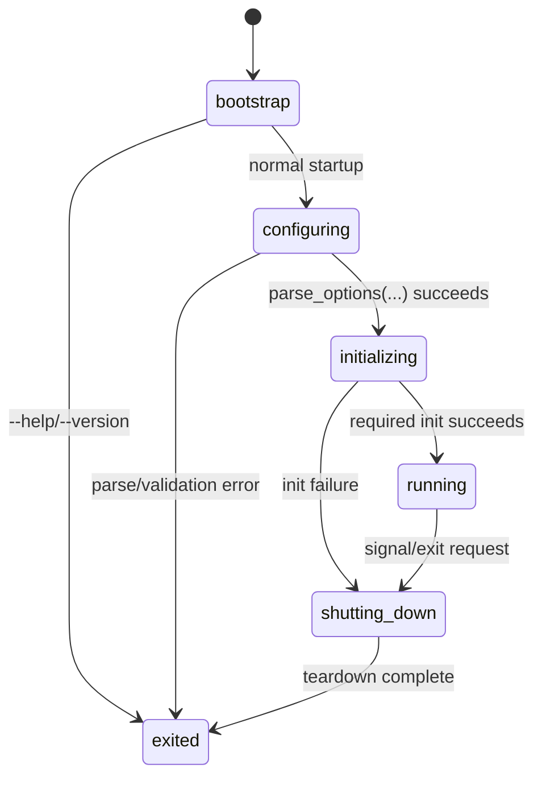

# Shairport Main Program Flow

## Scope
This note describes the purpose and execution flow of [shairport.c](shairport.c), the process entrypoint and orchestration layer for Shairport Sync.

## Purpose
[shairport.c](shairport.c) is the top-level coordinator for the daemon/process. It does not perform audio decoding or RTSP packet handling directly. Instead, it:

- establishes process-wide defaults
- parses and merges command-line and configuration file settings
- selects runtime mode (Classic AirPlay or AirPlay 2 when available)
- initializes major subsystems (audio backend, metadata, MQTT, D-Bus/MPRIS, activity monitor)
- starts listener threads
- owns orderly shutdown and resource cleanup

## High-Level Responsibilities

### 1. Process Bootstrap
- `main(...)` initializes exit/debug infrastructure.
- determines app name and default config path.
- handles early `--version` and `--help` exits.
- initializes logging and signal handlers.

### 2. Configuration and Option Resolution
- `parse_options(...)` is the central settings resolver.
- loads defaults first.
- reads configuration file values if present.
- re-applies command-line arguments with precedence over file values.
- validates option ranges and normalizes deprecated options.

### 3. Service-Mode Decision
- decides between auto/classic/airplay2 behavior.
- in AirPlay 2 builds, verifies required external dependencies and compatibility.
- sets service ports and AirPlay identity/feature fields.

### 4. Backend and Feature Initialization
- selects and initializes configured audio backend.
- applies FFmpeg channel-layout/mixdown configuration when enabled.
- starts optional components: metadata, metadata hub, DACP monitor, MQTT, D-Bus/MPRIS worker.
- starts activity monitor and RTSP listener thread.

### 5. Runtime Lifetime
- after startup, the main thread sleeps in a keepalive loop.
- worker threads handle control/data paths.

### 6. Shutdown and Cleanup
- `exit_function()` coordinates orderly teardown.
- `exit_rtsp_listener()` cancels and joins RTSP listener thread.
- signal handlers (`SIGINT`, `SIGTERM`) request clean exit.

## Main Control Flow

## Possible Transitions

This state machine uses only the transitions below; any other direct transition is invalid.

States used here:

- `bootstrap`: process has entered `main(...)` and is preparing runtime basics.
- `configuring`: options/config are being resolved and validated.
- `initializing`: subsystems and listener threads are being started.
- `running`: steady-state service loop.
- `shutting_down`: orderly teardown path via `exit_function()`.
- `exited`: process termination complete.

| From | Event / Guard | To | Side Effect |
|---|---|---|---|
| `bootstrap` | `--help` or `--version` early exit request | `exited` | usage/version output, process returns |
| `bootstrap` | normal startup continuation | `configuring` | defaults and config path setup |
| `configuring` | `parse_options(...)` succeeds | `initializing` | backend/feature init phase starts |
| `configuring` | parse/validation error | `exited` | startup abort with error status |
| `initializing` | all required subsystem init succeeds | `running` | activity monitor + RTSP listener active |
| `initializing` | init failure | `shutting_down` | partial startup rollback/cleanup |
| `running` | signal or explicit exit request | `shutting_down` | graceful termination begins |
| `shutting_down` | teardown complete | `exited` | resources released and process ends |

Invalid direct transitions (must not happen):

- `bootstrap -> running` without configuration and initialization.
- `running -> exited` without shutdown/teardown.
- `configuring -> running` without initialization.

## Key Functions and Their Roles

- `main(...)`: full startup orchestration and permanent run loop.
- `parse_options(...)`: reads defaults, config file, then CLI overrides.
- `usage(...)`: prints runtime usage and backend lists.
- `print_version(...)`: prints version string and exits.
- `exit_rtsp_listener()`: listener thread shutdown helper.
- `exit_function()`: complete cleanup path for all initialized subsystems.
- `handle_sigchld(...)`: reaps child processes from hook scripts.
- `intHandler(...)` / `termHandler(...)`: signal-triggered graceful exit request.
- `_display_config(...)`: diagnostic dump of effective environment/config.

## Configuration Flow Notes

`parse_options(...)` follows a strict precedence model:

1. internal defaults in code
2. configuration file values
3. command-line options (highest priority)

This ensures reproducible startup while preserving expected CLI override semantics.

## Threading and Subsystem Topology

At runtime, [shairport.c](shairport.c) supervises threads rather than processing streams itself:

- RTSP listener thread: created from `rtsp_listen_loop`
- activity monitor thread: started via `activity_monitor_start`
- optional GLib worker thread for D-Bus/MPRIS
- optional backend-specific helper threads (e.g., timing checks)

## Shutdown Sequence Summary

On controlled exit, [shairport.c](shairport.c) attempts shutdown in dependency-safe order:

1. stop activity monitor
2. stop DACP and optional control services
3. stop metadata services
4. deinit audio backend
5. stop auxiliary threads (including RTSP listener)
6. free dynamic config/service resources
7. unregister mDNS advertisement

This minimizes dangling threads and partially torn-down services.

## Why This File Matters

[shairport.c](shairport.c) is the integration boundary for nearly every major subsystem. Changes here affect startup behavior, service-mode compatibility, process lifecycle correctness, and operational safety during shutdown.
